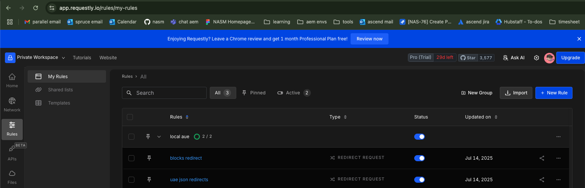

# Local Development: AEM Config JSON Redirect with Requestly

## Purpose
The local dev server (`server/dev-config-server.js`) serves local versions of AEM config JSON files for development and testing. It allows you to intercept requests for:
- `component-filters.json`
- `component-models.json`
- `component-definition.json`
and serve them from your local machine instead of the remote AEM environment.

## How to Start the Server
```sh
node server/dev-config-server.js
```
- The server listens on `http://localhost:3001` by default.
- Logs each GET request for the three JSON files.

## Using Requestly for Redirects
1. Install the [Requestly Chrome extension](https://chrome.google.com/webstore/detail/requestly/)
2. Import the collection into Requestly:
   
   **How to import the JSON collection into Requestly:**
   
   - Open the [Requestly Chrome extension](https://chrome.google.com/webstore/detail/requestly/) in your browser.
   - Click the Requestly icon and select "Open Requestly" or go to [https://app.requestly.io/rules](https://app.requestly.io/rules).
   - In the Requestly dashboard, click the "Import" or "Import Rules" button (usually at the top or in the sidebar).
   - Choose "From File" or "From JSON".
   - Upload or paste the contents of the file: `docs/requestly_export_14_07_2025.json` from this repository.
   - If uploading, you can drag and drop the file or use the file picker.
   - After import, ensure the rules are enabled (toggle switch should be ON). The rules should now appear in your list, e.g., "uae json redirects" and "blocks redirect".
   - 
   - With your local dev server running, test by accessing a URL that matches the rules (such as a `component-filters.json` or a block JS/CSS file). The request should be redirected to your local server as specified in the rules.
   
   **Tip:** If you see any errors during import, make sure you are importing the file as a collection (not as a single rule), and that the file is not modified from the export format.

## How to Verify
- Access any of the three JSON URLs in your browser (with Requestly enabled and server running).
- You should see the local file content.
- The terminal running the dev server will log each request, e.g.:
  ```
  GET /component-filters.json
  ```

## Troubleshooting
- If you see a 404, check that the dev server is running and the file exists.
- If the redirect does not work, ensure the Requestly rule is enabled and the regex matches the URL.
- Use the Requestly "Test regex" feature to confirm your pattern.


## Best Practice: Export Requestly Rules from the App

The most reliable way to get the correct import/export JSON format for Requestly is to create your rule in the Requestly app and use the app's export feature. Hand-crafted JSON may not match the app's internal schema and can fail to import. Always export your rules directly from the app for sharing or backup.

--- 