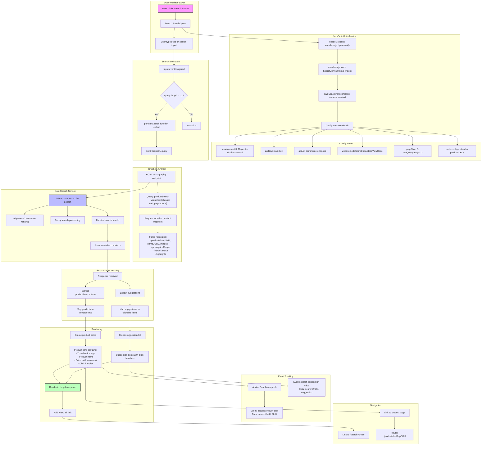
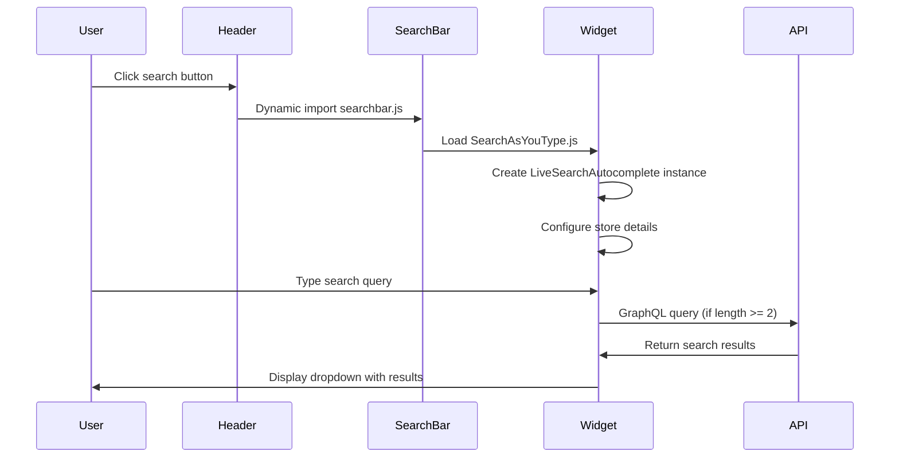
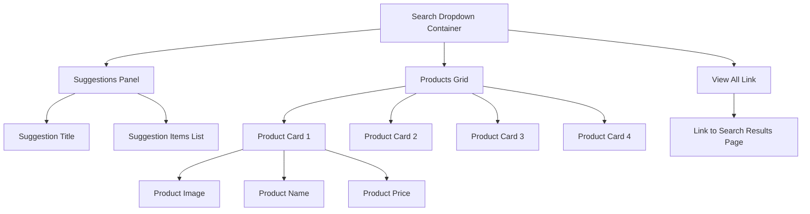

# Adobe Commerce Live Search Implementation Guide

## Overview

This document provides a comprehensive analysis of the Adobe Commerce Live Search functionality as implemented in the Adobe Commerce EDS (Edge Delivery Services) boilerplate. The search feature uses Adobe's AI-powered Live Search service to provide real-time product search with intelligent ranking and fuzzy matching capabilities.

## Table of Contents
1. [Architecture Overview](#architecture-overview)
2. [Complete Search Flow Diagram](#complete-search-flow-diagram)
3. [Implementation Details](#implementation-details)
4. [Configuration Requirements](#configuration-requirements)
5. [API Integration](#api-integration)
6. [Frontend Components](#frontend-components)
7. [Event Tracking](#event-tracking)
8. [Code Examples](#code-examples)

## Architecture Overview

The Adobe Commerce Live Search is a SaaS-based search service that replaces standard Commerce search capabilities with:
- AI-powered dynamic faceting and result re-ranking
- "Search as you type" functionality with product suggestions
- Fuzzy search with Levenshtein distance (max 1 edit per word)
- GraphQL API support for headless flexibility
- Ultra-fast search performance through lightweight SaaS architecture

## Complete Search Flow Diagram



## Implementation Details

### File Structure

The search implementation involves the following key files:

1. **`/blocks/header/header.js`** - Main header component that initializes the search functionality
2. **`/blocks/header/searchbar.js`** - Search initialization and configuration
3. **`/scripts/widgets/SearchAsYouType.js`** - Live Search widget (vendor file from Adobe)
4. **`/scripts/configs.js`** - Configuration helper functions

### Search Initialization Flow



## Configuration Requirements

### Store Configuration Object

```javascript
const storeDetails = {
    // Environment Configuration
    environmentId: getConfigValue('headers.cs.Magento-Environment-Id'),
    environmentType: (getConfigValue('commerce-endpoint')).includes('sandbox') ? 'testing' : '',
    apiKey: getConfigValue('headers.cs.x-api-key'),
    apiUrl: getConfigValue('commerce-endpoint'),
    
    // Store Configuration
    websiteCode: getConfigValue('headers.cs.Magento-Website-Code'),
    storeCode: getConfigValue('headers.cs.Magento-Store-Code'),
    storeViewCode: getConfigValue('headers.cs.Magento-Store-View-Code'),
    
    // Search Configuration
    config: {
        pageSize: 8,
        perPageConfig: {
            pageSizeOptions: '12,24,36',
            defaultPageSizeOption: '24',
        },
        minQueryLength: '2',
        currencySymbol: '$',
        currencyRate: '1',
        displayOutOfStock: true,
        allowAllProducts: false,
    },
    
    // Context Configuration
    context: {
        customerGroup: getConfigValue('headers.cs.Magento-Customer-Group'),
    },
    
    // Routing Configuration
    route: ({ sku, urlKey }) => rootLink(`/products/${urlKey}/${sku}`),
    searchRoute: {
        route: rootLink('/search'),
        query: 'q',
    },
};
```

### Required Headers

The following headers must be configured for API calls:

- `Magento-Environment-Id`: Environment identifier
- `Magento-Store-Code`: Store code
- `Magento-Store-View-Code`: Store view code
- `Magento-Website-Code`: Website code
- `Magento-Customer-Group`: Customer group for pricing
- `x-api-key`: API authentication key

## API Integration

### GraphQL Endpoint

The search uses a specialized Commerce Services GraphQL endpoint:
- **Production**: `https://www.aemshop.net/cs-graphql`
- **Testing**: Uses sandbox URL with `environmentType: 'testing'`

### GraphQL Query Structure

```graphql
query productSearch(
    $phrase: String!
    $pageSize: Int
    $currentPage: Int = 1
    $filter: [SearchClauseInput!]
    $sort: [ProductSearchSortInput!]
    $context: QueryContextInput
) {
    attributeMetadata {
        sortable {
            label
            attribute
            numeric
        }
        filterableInSearch {
            label
            attribute
            numeric
        }
    }
    productSearch(
        phrase: $phrase
        page_size: $pageSize
        current_page: $currentPage
        filter: $filter
        sort: $sort
        context: $context
    ) {
        total_count
        items {
            ...ProductView
        }
        facets {
            ...Facet
        }
        page_info {
            current_page
            page_size
            total_pages
        }
    }
}

fragment ProductView on ProductSearchItem {
    productView {
        __typename
        sku
        name
        inStock
        url
        urlKey
        images {
            label
            url
            roles
        }
        ... on ComplexProductView {
            priceRange {
                maximum {
                    final {
                        amount {
                            value
                            currency
                        }
                    }
                    regular {
                        amount {
                            value
                            currency
                        }
                    }
                }
                minimum {
                    final {
                        amount {
                            value
                            currency
                        }
                    }
                    regular {
                        amount {
                            value
                            currency
                        }
                    }
                }
            }
            options {
                id
                title
                values {
                    title
                    ... on ProductViewOptionValueSwatch {
                        id
                        inStock
                        type
                        value
                    }
                }
            }
        }
        ... on SimpleProductView {
            price {
                final {
                    amount {
                        value
                        currency
                    }
                }
                regular {
                    amount {
                        value
                        currency
                    }
                }
            }
        }
    }
    highlights {
        attribute
        value
        matched_words
    }
}
```

### API Response Example

```json
{
    "data": {
        "productSearch": {
            "total_count": 4,
            "items": [
                {
                    "productView": {
                        "sku": "TEESHIRT",
                        "name": "Tee Shirt",
                        "inStock": true,
                        "urlKey": "tee-shirt",
                        "images": [
                            {
                                "url": "https://www.aemshop.net/media/catalog/product/...",
                                "label": "Tee Shirt",
                                "roles": ["thumbnail"]
                            }
                        ],
                        "priceRange": {
                            "minimum": {
                                "final": {
                                    "amount": {
                                        "value": 15.00,
                                        "currency": "USD"
                                    }
                                }
                            },
                            "maximum": {
                                "final": {
                                    "amount": {
                                        "value": 25.00,
                                        "currency": "USD"
                                    }
                                }
                            }
                        }
                    }
                }
            ],
            "suggestions": [
                "tee shirt",
                "youth tee",
                "bezier tee"
            ]
        }
    }
}
```

## Frontend Components

### Search Dropdown Structure



### Component Hierarchy

1. **Search Button** (`nav-search-button`)
   - Toggles search panel visibility
   - Triggers dynamic loading of search functionality

2. **Search Input** (`#search`)
   - Accepts user input
   - Triggers search after 2+ characters
   - Debounced to prevent excessive API calls

3. **Search Results Dropdown** (`search-autocomplete`)
   - **Suggestions Section**: Clickable search suggestions
   - **Products Grid**: 2x2 grid of product cards (desktop) or vertical list (mobile)
   - **View All Link**: Navigation to full search results page

### CSS Classes and Styling

```css
/* Main search components */
.search-wrapper.nav-tools-wrapper
.nav-search-button
.nav-search-input.nav-search-panel.nav-tools-panel
.search-autocomplete

/* Dropdown styling */
.search-bar-result.dropin-design {
    display: flex;
    right: 0px;
    margin-top: 5px;
    box-shadow: 0px 0px 6px 0px #cacaca;
    background-color: #fff;
}

/* Product cards */
.product-discovery-product-list {
    grid-template-columns: 1fr 1fr;
    grid-template-rows: repeat(3, 1fr);
    gap: 4px;
    padding: 16px;
}
```

## Event Tracking

### Events Fired

The search implementation fires the following events:

1. **`popover/search/loading`**
   - Fired when search request starts
   - Payload: `true` when loading, `false` when complete

2. **`popover/search/result`**
   - Fired when search results are received
   - Payload: `{ request: {...}, result: {...} }`

3. **`search-product-click`**
   - Fired when a product in the dropdown is clicked
   - Pushed to Adobe Data Layer
   - Payload: `{ searchUnitId, sku, ...state }`

4. **`search-suggestion-click`**
   - Fired when a suggestion is clicked
   - Pushed to Adobe Data Layer
   - Payload: `{ searchUnitId, suggestion, ...state }`

### Adobe Data Layer Integration

```javascript
// Product click tracking
window.adobeDataLayer.push((dataLayer) => {
    dataLayer.push({
        event: 'search-product-click',
        eventInfo: {
            ...dataLayer.getState(),
            searchUnitId: 'search-bar',
            sku: product.sku
        }
    });
});

// Suggestion click tracking
window.adobeDataLayer.push((dataLayer) => {
    dataLayer.push({
        event: 'search-suggestion-click',
        eventInfo: {
            ...dataLayer.getState(),
            searchUnitId: 'search-bar',
            suggestion: suggestionText
        }
    });
});
```

## Code Examples

### 1. Initializing Search in Header

```javascript
// In blocks/header/header.js
const search = document.createRange().createContextualFragment(`
    <div class="search-wrapper nav-tools-wrapper">
        <button type="button" class="nav-search-button">Search</button>
        <div class="nav-search-input nav-search-panel nav-tools-panel">
            <form action="/search" method="GET">
                <input id="search" type="search" name="q" placeholder="Search" />
                <div id="search_autocomplete" class="search-autocomplete"></div>
            </form>
        </div>
    </div>
`);

navTools.append(search);

// Toggle search panel
async function toggleSearch(state) {
    const show = state ?? !searchPanel.classList.contains('nav-tools-panel--show');
    searchPanel.classList.toggle('nav-tools-panel--show', show);
    
    if (show) {
        await import('./searchbar.js');
        searchInput.focus();
    }
}
```

### 2. Search Configuration Setup

```javascript
// In blocks/header/searchbar.js
import { loadScript } from '../../scripts/aem.js';
import { getConfigValue } from '../../scripts/configs.js';

(async () => {
    const widgetProd = '/scripts/widgets/SearchAsYouType.js';
    await loadScript(widgetProd);

    const storeDetails = {
        environmentId: getConfigValue('headers.cs.Magento-Environment-Id'),
        environmentType: (getConfigValue('commerce-endpoint')).includes('sandbox') ? 'testing' : '',
        apiKey: getConfigValue('headers.cs.x-api-key'),
        apiUrl: getConfigValue('commerce-endpoint'),
        websiteCode: getConfigValue('headers.cs.Magento-Website-Code'),
        storeCode: getConfigValue('headers.cs.Magento-Store-Code'),
        storeViewCode: getConfigValue('headers.cs.Magento-Store-View-Code'),
        config: {
            pageSize: 8,
            minQueryLength: '2',
            currencySymbol: '$',
            currencyRate: '1',
            displayOutOfStock: true,
        },
        context: {
            customerGroup: getConfigValue('headers.cs.Magento-Customer-Group'),
        },
        route: ({ sku, urlKey }) => rootLink(`/products/${urlKey}/${sku}`),
        searchRoute: {
            route: rootLink('/search'),
            query: 'q',
        },
    };

    // Wait for widget to load
    await new Promise((resolve) => {
        const interval = setInterval(() => {
            if (window.LiveSearchAutocomplete) {
                clearInterval(interval);
                resolve();
            }
        }, 200);
    });

    // Initialize search
    new window.LiveSearchAutocomplete(storeDetails);
})();
```

### 3. Product Card Rendering

```javascript
// Simplified product card component
const ProductCard = ({ product, currencySymbol, route }) => {
    const imageUrl = product.thumbnail?.url || product.image?.url || placeholderImage;
    const productUrl = route({ 
        urlKey: product.productView.urlKey, 
        sku: product.sku 
    });
    
    return (
        <a href={productUrl} className="product-result">
            
            <div className="product-name">{product.name}</div>
            <div className="product-price">
                {currencySymbol}{product.price.toFixed(2)}
            </div>
        </a>
    );
};
```

## Performance Optimizations

### 1. Dynamic Loading
- Search functionality is loaded only when needed
- Widget JavaScript is imported dynamically on first search button click
- Reduces initial page load by ~40KB

### 2. Debouncing
- Search queries are debounced to prevent excessive API calls
- Default debounce delay: 300ms
- Configurable through widget options

### 3. Caching
- Search results are cached client-side
- Cache duration: Session-based
- Reduces redundant API calls for repeated searches

### 4. Image Optimization
- Product images use WebP format with fallback
- Responsive sizing: `?auto=webp&quality=80&crop=false&fit=cover&width=400`
- Lazy loading for below-fold images

## Troubleshooting

### Common Issues and Solutions

1. **Search not appearing**
   - Check if `SearchAsYouType.js` is loaded
   - Verify API credentials in configuration
   - Check browser console for errors

2. **No results returned**
   - Verify `minQueryLength` is set correctly (default: 2)
   - Check if Live Search is enabled in Adobe Commerce
   - Verify product catalog is synchronized

3. **Incorrect pricing**
   - Check `currencySymbol` and `currencyRate` configuration
   - Verify customer group settings
   - Check store view configuration

4. **Event tracking not working**
   - Ensure Adobe Data Layer is initialized
   - Check for `window.adobeDataLayer` availability
   - Verify event names match analytics configuration

## Implementation Checklist

- [ ] Adobe Commerce Live Search service configured
- [ ] API credentials obtained (Environment ID, API Key)
- [ ] SearchAsYouType.js widget file included
- [ ] Event bus integration configured
- [ ] Adobe Data Layer initialized
- [ ] Store configuration values set
- [ ] Search route configured
- [ ] Product URL pattern defined
- [ ] CSS styling applied
- [ ] Mobile responsive design tested
- [ ] Analytics events configured
- [ ] Performance optimizations implemented

## References

- [Adobe Commerce Live Search Documentation](https://experienceleague.adobe.com/en/docs/commerce/live-search/overview)
- [Adobe Commerce GraphQL API](https://developer.adobe.com/commerce/webapi/graphql/)
- [Edge Delivery Services Documentation](https://www.aem.live/docs/)
- [Adobe Data Layer Documentation](https://github.com/adobe/adobe-client-data-layer)

## Summary

The Adobe Commerce Live Search implementation provides a sophisticated, AI-powered search experience that integrates seamlessly with the Edge Delivery Services architecture. Key features include:

- Real-time search with instant results
- AI-powered relevance ranking
- Fuzzy search capabilities
- Mobile-responsive design
- Comprehensive event tracking
- Performance-optimized loading

By following this implementation guide, you can replicate the search functionality in your own Adobe Commerce EDS project, ensuring a consistent and powerful search experience for your users.