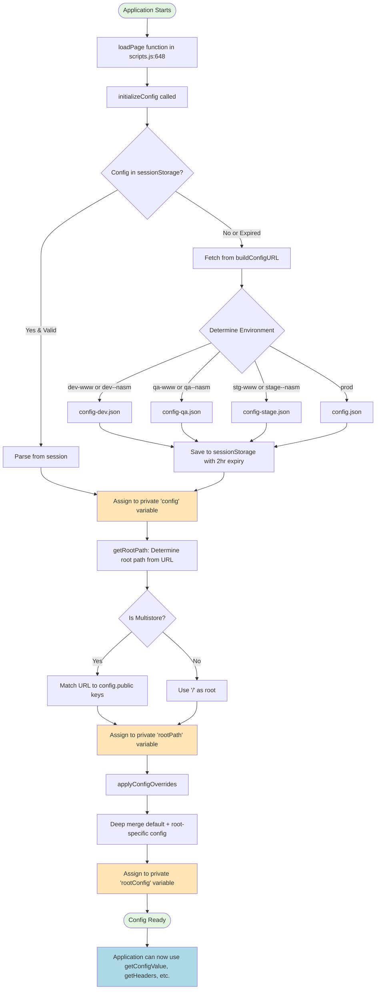

# Configuration System Documentation

## Overview

The NASM application uses a centralized configuration system built on **module-level private state** and **closure-based encapsulation**. This design pattern allows configuration to be initialized once and accessed globally throughout the application without using global variables directly.

## Core Concept: Module-Level Private State

The configuration system leverages JavaScript ES6 module semantics to create shared state that is:
- **Private**: Not directly accessible from outside the module
- **Singleton**: Only one instance exists across the entire application
- **Persistent**: Lives for the lifetime of the application

### Private State Variables

```javascript
// scripts/configs.js - Lines 7-10
let config = null;      // Raw config from remote JSON
let rootPath = null;    // Current root path based on URL
let rootConfig = null;  // Merged config with overrides applied
```

These three variables form the backbone of the configuration system. They are:
- Declared at the module level (outside any function)
- Not exported, making them truly private
- Shared across all function invocations within the module
- Modified only by `initializeConfig()` and helper functions

## Configuration Initialization Flow



## Step-by-Step Initialization Process

### 1. Entry Point
```javascript
// scripts/scripts.js - Line 649
async function loadPage() {
  await initializeConfig();  // First step in page load
  await loadEager(document);
  await loadLazy(document);
  loadDelayed();
}

loadPage();  // Executed immediately when scripts.js loads
```

### 2. Initialize Configuration
```javascript
// scripts/configs.js - Lines 220-224
async function initializeConfig() {
  config = await getConfigFromSession();              // Step 1: Get raw config
  rootPath = getRootPath(config);                     // Step 2: Determine root path
  rootConfig = await applyConfigOverrides(config, rootPath); // Step 3: Apply overrides
}
```

This function performs three critical assignments to the module-level private variables.

### 3. Fetch or Retrieve Config (Step 1)

```javascript
// scripts/configs.js - Lines 192-214
async function getConfigFromSession() {
  try {
    // Try to get from sessionStorage first
    const configJSON = window.sessionStorage.getItem('config');
    if (!configJSON) throw new Error('No config in session storage');
    
    const parsedConfig = JSON.parse(configJSON);
    
    // Check if expired (2 hour TTL)
    if (!parsedConfig[':expiry'] || parsedConfig[':expiry'] < Math.round(Date.now() / 1000)) {
      throw new Error('Config expired');
    }
    return parsedConfig;
  } catch (e) {
    // Fetch from remote if not in session or expired
    let configJSON = await fetch(buildConfigURL());
    if (!configJSON.ok) throw new Error('Failed to fetch config');
    
    configJSON = await configJSON.json();
    
    // Add 2-hour expiry timestamp
    configJSON[':expiry'] = Math.round(Date.now() / 1000) + 7200;
    
    // Cache in sessionStorage
    window.sessionStorage.setItem('config', JSON.stringify(configJSON));
    return configJSON;
  }
}
```

**Key Features:**
- **Caching**: Uses sessionStorage to avoid repeated network requests
- **Expiry**: 2-hour time-to-live (7200 seconds)
- **Environment-aware**: `buildConfigURL()` selects the appropriate config file

#### Environment Detection

```javascript
// scripts/configs.js - Lines 22-35
function buildConfigURL() {
  let configFile = 'config.json';  // Default: production
  
  if (window.location.href.includes('stage--nasm') || 
      window.location.href.includes('stg-www.')) {
    configFile = 'config-stage.json';
  }
  if (window.location.href.includes('qa--nasm') || 
      window.location.href.includes('qa-www.')) {
    configFile = 'config-qa.json';
  }
  if (window.location.href.includes('dev--nasm') || 
      window.location.href.includes('dev-www.')) {
    configFile = 'config-dev.json';
  }
  
  return new URL(`${window.hlx.codeBasePath}/${configFile}`, window.location);
}
```

### 4. Determine Root Path (Step 2)

```javascript
// scripts/configs.js - Lines 86-108
function getRootPath(configObj = config) {
  if (!configObj) {
    console.warn('No config found. Please call initializeConfig() first.');
    return '/';
  }
  
  // Find the deepest matching path from config.public keys
  const value = Object.keys(configObj?.public)
    .sort((a, b) => {
      // Sort by number of path segments (deepest first)
      const aSegments = a.split('/').filter(Boolean).length;
      const bSegments = b.split('/').filter(Boolean).length;
      return bSegments - aSegments;
    })
    .find((key) => 
      window.location.pathname === key || 
      window.location.pathname.startsWith(key)
    );
  
  rootPath = value ?? '/';
  
  if (!rootPath.startsWith('/') || !rootPath.endsWith('/')) {
    throw new Error('Invalid root path');
  }
  
  return rootPath;
}
```

**Purpose**: Supports multi-store configurations where different URL paths map to different store configurations.

**Example**:
- Config has keys: `"/", "/store-a/", "/store-b/"`
- URL is: `https://example.com/store-a/products`
- Result: `rootPath = "/store-a/"`

### 5. Apply Config Overrides (Step 3)

```javascript
// scripts/configs.js - Lines 167-184
async function applyConfigOverrides(configObj = config, root = rootPath) {
  if (!configObj) {
    throw new Error('Configuration not initialized. Call initializeConfig() first.');
  }
  
  const defaultConfig = configObj.public?.default;
  
  if (!defaultConfig) {
    throw new Error('No "default" config found.');
  }
  
  // Deep merge default config with root-specific config
  const current = deepmerge(
    defaultConfig,
    root === '/' ? defaultConfig : configObj.public[root] || defaultConfig,
  );
  
  return current;
}
```

**Merging Strategy**:
1. Start with `config.public.default`
2. If `rootPath !== '/'`, deep merge with `config.public[rootPath]`
3. Root-specific values override defaults
4. Uses `deepmerge` from `@dropins/tools/lib.js`

## Config Structure

Example from `config-dev.json`:

```json
{
  "public": {
    "default": {
      "commerce-core-endpoint": "https://na1-sandbox.api.commerce.adobe.com/.../graphql",
      "commerce-endpoint": "https://edge-sandbox-graph.adobe.io/api/.../graphql",
      "headers": {
        "all": {
          "Store": "default"
        },
        "cs": {
          "Magento-Customer-Group": "b6589fc6ab0dc82cf12099d1c2d40ab994e8410c",
          "Magento-Store-Code": "main_website_store",
          "Magento-Store-View-Code": "default",
          "Magento-Website-Code": "base",
          "x-api-key": "not_used",
          "Magento-Environment-Id": "TcjrmcuW2PUdxP9tLzhBsi"
        }
      },
      "analytics": {
        "base-currency-code": "USD",
        "environment": "Production",
        "store-id": 1,
        "store-name": "Main Website Store"
      },
      "plugins": {
        "picker": {
          "rootCategory": "2"
        }
      }
    }
  }
}
```

**Key Properties**:
- `commerce-core-endpoint`: Adobe Commerce Core GraphQL endpoint
- `commerce-endpoint`: Adobe Commerce Edge GraphQL endpoint  
- `headers.all`: Headers applied to all requests
- `headers.cs`: Headers for Catalog Service requests
- `headers.checkout`: Headers for Checkout requests
- `headers.pdp`: Headers for Product Detail Page requests
- `analytics`: Analytics configuration
- `plugins`: Plugin-specific configurations

## How Config Becomes Available Application-Wide

### The Module Closure Pattern

When any module imports functions from `configs.js`, those functions have **closure access** to the private state variables:

```javascript
// scripts/configs.js - Lines 295-313
export {
  initializeConfig,
  getConfigValue,
  getHeaders,
  getRootPath,
  getListOfRootPaths,
  isMultistore,
  checkIsAuthenticated,
  getCookie,
  setCookie,
  // ... etc
};
```

These exported functions can read and operate on `config`, `rootPath`, and `rootConfig` because they are defined in the same module scope.

### Accessing Config Values

#### Using `getConfigValue()`

```javascript
// scripts/configs.js - Lines 232-237
function getConfigValue(configParam) {
  if (!rootConfig) {
    throw new Error('Configuration not initialized. Call initializeConfig() first.');
  }
  return getValue(rootConfig, configParam);
}
```

**Supports dot notation** for nested properties:

```javascript
// scripts/commerce.js - Lines 177-183
export async function performMonolithGraphQLQuery(query, variables, GET = true, USE_TOKEN = false) {
  const GRAPHQL_ENDPOINT = getConfigValue('commerce-core-endpoint');
  
  const headers = {
    'Content-Type': 'application/json',
    Store: getConfigValue('headers.cs.Magento-Store-View-Code'),  // Dot notation!
  };
  // ...
}
```

The `getValue()` helper function traverses the config object:

```javascript
// scripts/configs.js - Lines 44-52
function getValue(obj, key) {
  return key.split('.').reduce((current, part) => {
    if (!Object.prototype.hasOwnProperty.call(current, part)) {
      console.warn(`Property ${key} does not exist in the object`);
      return undefined;
    }
    return current[part];
  }, obj);
}
```

#### Using `getHeaders()`

```javascript
// scripts/configs.js - Lines 137-146
function getHeaders(scope) {
  if (!rootConfig) {
    throw new Error('Configuration not initialized. Call initializeConfig() first.');
  }
  const headers = rootConfig.headers ?? {};
  return {
    ...headers.all ?? {},    // Always include headers.all
    ...headers[scope] ?? {}, // Merge scope-specific headers
  };
}
```

**Merging Strategy**: 
- Combines `headers.all` with scope-specific headers
- Scope-specific values override `all` values
- Common scopes: `cs`, `checkout`, `pdp`

## Real-World Usage Examples

### Example 1: Commerce GraphQL Queries

```javascript
// scripts/commerce.js - Lines 177-221
export async function performMonolithGraphQLQuery(query, variables, GET = true, USE_TOKEN = false) {
  // Get endpoint from config
  const GRAPHQL_ENDPOINT = getConfigValue('commerce-core-endpoint');
  
  const headers = {
    'Content-Type': 'application/json',
    // Get store view code using dot notation
    Store: getConfigValue('headers.cs.Magento-Store-View-Code'),
  };
  
  if (USE_TOKEN) {
    const token = getSignInToken();
    if (token) {
      headers.Authorization = `Bearer ${token}`;
    }
  }
  
  let response;
  if (!GET) {
    response = await fetch(GRAPHQL_ENDPOINT, {
      method: 'POST',
      headers,
      body: JSON.stringify({ query, variables }),
    });
  } else {
    const endpoint = new URL(GRAPHQL_ENDPOINT);
    endpoint.searchParams.set('query', query);
    endpoint.searchParams.set('variables', JSON.stringify(variables));
    response = await fetch(endpoint.toString(), { headers });
  }
  
  return response.json();
}
```

### Example 2: Product Detail Page Initialization

```javascript
// scripts/initializers/pdp.js - Lines 27-36
await initializeDropin(async () => {
  // Set GraphQL endpoint
  setEndpoint(await commerceEndpointWithQueryParams());
  
  // Set headers using getHeaders() with 'cs' scope
  setFetchGraphQlHeaders((prev) => ({
    ...prev,
    ...getHeaders('cs'),          // Gets headers.all + headers.cs
    nasmprice: 'all',             // Add custom header
  }));
  
  // ... rest of PDP initialization
});
```

### Example 3: Checkout Initialization

```javascript
// scripts/initializers/checkout.js - Lines 7-18
await initializeDropin(async () => {
  // Set headers specific to checkout
  setFetchGraphQlHeaders((prev) => ({ 
    ...prev, 
    ...getHeaders('checkout')  // Gets headers.all + headers.checkout
  }));
  
  const labels = await fetchPlaceholders();
  const langDefinitions = {
    default: { ...labels },
  };
  
  return initializers.mountImmediately(initialize, { langDefinitions });
})();
```

### Example 4: Search/Autocomplete

```javascript
// blocks/header/searchbar-dropin.js - Lines 50-66
export default async function initSearchDropin(config = {}) {
  const { searchInputId = 'search', autocompleteContainerId = 'search_autocomplete' } = config;
  
  // Set endpoint from config
  setEndpoint(getConfigValue('commerce-endpoint'));
  
  // Set headers for catalog service
  const csHeaders = getConfigValue('headers.cs');
  if (csHeaders) {
    Object.entries(csHeaders).forEach(([key, value]) => {
      setFetchGraphQlHeader(key, value);
    });
  }
  
  // Add headers.all
  const allHeaders = getConfigValue('headers.all');
  if (allHeaders) {
    Object.entries(allHeaders).forEach(([key, value]) => {
      setFetchGraphQlHeader(key, value);
    });
  }
  
  // ... rest of search initialization
}
```

### Example 5: Link Localization

```javascript
// scripts/scripts.js - Lines 609-615
export function rootLink(link) {
  const root = getRootPath().replace(/\/$/, '');  // Access rootPath via function
  
  // If the link is already localized, do nothing
  if (link?.startsWith(root)) return link;
  return `${root}${link}`;
}
```

## Advanced Features

### Multi-Store Support

```javascript
// scripts/configs.js - Lines 114-121
function getListOfRootPaths() {
  if (!config) {
    console.warn('No config found. Please call initializeConfig() first.');
    return [];
  }
  return Object.keys(config?.public).filter((root) => root !== 'default');
}

// scripts/configs.js - Lines 127-129
function isMultistore() {
  return getListOfRootPaths().length >= 1;
}
```

When multiple stores are configured:
- Each store has its own key in `config.public` (e.g., `"/store-a/"`, `"/store-b/"`)
- `getRootPath()` matches the current URL to the appropriate store
- `applyConfigOverrides()` merges store-specific config with defaults

### Link Decoration for Multi-Store

```javascript
// scripts/scripts.js - Lines 342-369
function decorateLinks(main) {
  const root = getRootPath();
  const roots = getListOfRootPaths();
  
  main.querySelectorAll('a').forEach((a) => {
    // If single store, do nothing
    if (roots.length === 0) return;
    
    try {
      const url = new URL(a.href);
      const { origin, pathname, search, hash } = url;
      
      // If link belongs to another store, do nothing
      if (roots.some((r) => r !== root && pathname.startsWith(r))) return;
      
      // If link is already localized, do nothing
      if (origin !== window.location.origin || pathname.startsWith(root)) return;
      
      // Add root path prefix
      a.href = new URL(`${origin}${root}${pathname.replace(/^\//, '')}${search}${hash}`);
    } catch {
      console.warn('Could not make localized link');
    }
  });
}
```

### Environment Detection

```javascript
// scripts/configs.js - Lines 239-251
function getEnvironment() {
  const { hostname } = window.location;
  
  if (hostname.includes('dev-www.') || 
      hostname.includes('main--') || 
      hostname.startsWith('localhost')) {
    return 'dev';
  }
  if (hostname.includes('qa-www.') || hostname.includes('qa--')) {
    return 'qa';
  }
  if (hostname.includes('stg-www.') || hostname.includes('stage--')) {
    return 'stage';
  }
  return 'prod';
}
```

## Security & Best Practices

### 1. Private State Encapsulation

✅ **Good**: Config variables are private module-level state
```javascript
let config = null;  // Not exported, truly private
```

❌ **Bad**: Directly exposing config as global
```javascript
window.appConfig = config;  // DON'T DO THIS
```

### 2. Initialization Guarantees

All public functions check initialization:
```javascript
function getConfigValue(configParam) {
  if (!rootConfig) {
    throw new Error('Configuration not initialized. Call initializeConfig() first.');
  }
  // ... proceed safely
}
```

### 3. Immutability

Config is set once during initialization. Functions only **read** from it, never modify:
```javascript
// ✅ Reading is safe and encouraged
const endpoint = getConfigValue('commerce-endpoint');

// ❌ Never attempt to modify
// config.newValue = 'something';  // Won't work anyway, config is private!
```

### 4. Session Storage Caching

- Reduces network requests
- 2-hour expiry balances freshness and performance
- Handles missing/expired data gracefully

## Troubleshooting

### Error: "Configuration not initialized"

**Cause**: Attempting to use `getConfigValue()` or `getHeaders()` before `initializeConfig()` completes.

**Solution**: Ensure `initializeConfig()` is called and awaited before using any config functions:
```javascript
await initializeConfig();
const value = getConfigValue('some-key');  // Now safe
```

### Error: "No config in session storage" + Fetch Fails

**Cause**: Network failure or incorrect config file path.

**Solution**: 
1. Check network tab for failed requests
2. Verify config file exists at expected location
3. Check `buildConfigURL()` logic matches your environment

### Warning: "Property X does not exist in the object"

**Cause**: Requesting a config property that doesn't exist.

**Solution**:
1. Check config file structure
2. Verify spelling and case
3. Ensure dot notation path is correct (e.g., `headers.cs.Store`)

## Summary

The NASM configuration system is a elegant example of **module-level state management** that:

1. **Initializes once** at application startup via `initializeConfig()`
2. **Uses closures** to provide controlled access to private state
3. **Supports multi-store** configurations with path-based routing
4. **Caches efficiently** in sessionStorage with TTL
5. **Merges configurations** from defaults and store-specific overrides
6. **Provides type-safe access** through well-defined getter functions
7. **Supports dot notation** for nested property access
8. **Fails safely** with clear error messages when not initialized

This pattern avoids global pollution while maintaining singleton behavior, making it ideal for application-wide configuration management.

## Related Files

- `scripts/configs.js` - Core configuration module
- `scripts/scripts.js` - Main entry point, calls `initializeConfig()`
- `config.json` - Production configuration
- `config-dev.json` - Development configuration
- `config-qa.json` - QA configuration
- `config-stage.json` - Staging configuration
- `scripts/initializers/*.js` - Various dropin initializers using config
- `scripts/commerce.js` - Commerce operations using config

