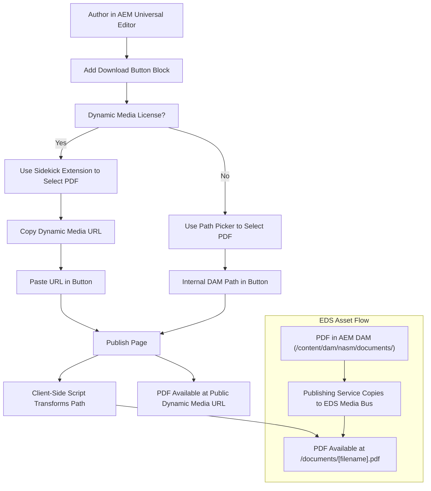

# PDF Asset Authoring and Publishing Workflow

This diagram summarizes the two main authoring workflows for PDF download buttons in AEM Edge Delivery Services, and the asset publishing/link transformation process.

