# NASM Header Construction Flow Documentation

## Overview
The NASM header is constructed through a multi-step process that includes navigation, mini cart, search, and authentication components. The header is built from fragments and enhanced with commerce dropins.

## Complete Header Construction Flow

```mermaid
---
config:
    theme: default
    securityLevel: loose
---
flowchart TD
    Start["Page Load"] --> LoadHeader["header.js decorate()"]
    LoadHeader --> LoadNav["Load Navigation Fragment"]
    
    LoadNav --> CreateNav["Create nav structure"]
    CreateNav --> SetupBrand["Setup Brand Section"]
    CreateNav --> SetupSections["Setup Nav Sections"]
    CreateNav --> SetupTools["Setup Nav Tools"]
    
    SetupSections --> ProcessNavItems["Process Nav Items"]
    ProcessNavItems --> AddDropdowns["Add nav-drop class"]
    ProcessNavItems --> SetupSubmenus["Setup Submenus"]
    ProcessNavItems --> AddNavListeners["Add Nav Event Listeners"]
    
    SetupTools --> CreateMiniCart["Create Mini Cart"]
    SetupTools --> CreateSearch["Create Search"] 
    SetupTools --> CreateAuthDropdown["Create Auth Dropdown"]
    
    CreateMiniCart --> LoadMiniCartFragment["Load /mini-cart fragment"]
    LoadMiniCartFragment --> AttachCartButton["Attach Cart Button"]
    AttachCartButton --> CartEventListener["Listen: cart/data event"]
    
    CreateSearch --> AttachSearchButton["Attach Search Button"]
    
    CreateAuthDropdown --> RenderAuthDropdown["renderAuthDropdown()"]
    RenderAuthDropdown --> CheckAuthState["Check Auth State"]
    CheckAuthState --> AuthUI["Update Auth UI"]
    
    AddNavListeners --> SetupHamburger["Setup Mobile Hamburger"]
    SetupHamburger --> SetupOverlay["Setup Overlay"]
    SetupOverlay --> SetupAuthCombine["renderAuthCombine()"]
    SetupAuthCombine --> RestoreCart["restoreCartForGuestSession()"]
    RestoreCart --> Complete["Header Ready"]
```



## Mini Cart Flow

### Mini Cart Initialization and Events


### Mini Cart Data Flow


## Authentication Dropdown Flow

### Nav Dropdown Button and Panel Interaction


### Authentication State Management


## Event Listeners and Interactions

### Global Event System


## Panel State Management

### Panel Visibility Control


## Mobile vs Desktop Behavior


## Key Components and Their Roles

### Component Responsibilities

| Component | File | Responsibility |
|-----------|------|---------------|
| Main Header | `header.js` | Orchestrates header construction |
| Mini Cart | Fragment + dropin | Shopping cart display and interaction |
| Search | Inline HTML | Product search functionality |
| Auth Dropdown | `renderAuthDropdown.js` | User authentication menu |
| Auth Combine | `renderAuthCombine.js` | Mobile auth modal |
| Navigation | Fragment | Main navigation structure |

### Event Flow Summary

1. **Initialization Phase**:
   - Load navigation fragment
   - Create DOM structure
   - Setup event listeners

2. **Interactive Phase**:
   - Button clicks toggle panels
   - Outside clicks close panels
   - Events update UI state

3. **State Management**:
   - Authentication state via cookies
   - Cart state via event bus
   - Panel visibility via CSS classes

4. **Responsive Behavior**:
   - Media query detection
   - Different behaviors for mobile/desktop
   - Window resize handling

## CSS Classes for State

### Panel Visibility Classes
- `nav-tools-panel--show`: Panel is visible
- `active`: Mobile menu/navigation active
- `show`: Overlay visible

### Authentication State Classes
- `authenticated-user-menu`: Shown when logged in
- `auth-dropin-container`: Shown when logged out

## Event System Details

### Cart Events
```javascript
events.on('cart/data', (data) => {
  // Updates cart button counter
  cartButton.setAttribute('data-count', data.totalQuantity);
});
```

### Authentication Events
```javascript
events.on('authenticated', (isAuthenticated) => {
  // Updates auth dropdown UI
  updateDropDownUI(isAuthenticated);
});
```

### Click Outside Handling
```javascript
document.addEventListener('click', (e) => {
  // Close panels when clicking outside
  if (!panel.contains(e.target) && !button.contains(e.target)) {
    togglePanel(false);
  }
});
```

## Implementation Comparison: Header vs Navigation

### Key Differences in Navigation Implementation

The navigation blocks implement a **different approach** compared to the header:

#### Mini Cart Implementation
- **Header**: Creates separate instances for desktop/mobile
- **Navigation**: Uses singleton pattern with responsive container movement
  - Single `miniCartElement` moves between containers
  - Resize listener with 150ms debouncing
  - Breakpoint at 992px for desktop/mobile switching

#### Authentication Implementation
- **Header**: Direct auth dropdown integration
- **Navigation**: Auth handled by separate login-nav widget
  - Cleaner separation of concerns
  - Dedicated login-nav component manages auth state

#### Container Management
- **Header**: Multiple container instances
- **Navigation**: Dynamic container switching based on viewport

### Shared Patterns
- Event system integration (`cart/data`, `authenticated`)
- Panel visibility management with CSS classes
- Fragment loading for mini cart content
- ARIA attributes for accessibility

## Files Referenced

### Header Implementation
- `/blocks/header/header.js:167-370` - Main header construction
- `/blocks/header/renderAuthDropdown.js:30-124` - Auth dropdown logic
- `/blocks/header/renderAuthCombine.js:212-289` - Mobile auth modal
- `/blocks/header/render-mini-cart.html` - Mini cart HTML template
- `/blocks/header/render-login.html` - Login panel HTML template

### Navigation Implementation
- `/blocks/nav/nav-dropins.js:17-77` - Singleton mini cart with resize listener
- `/blocks/nav/desktop-nav-root.js` - Desktop navigation structure
- `/blocks/nav/nav-mobile-header.js` - Mobile navigation structure
- `/blocks/login-nav/` - Dedicated auth widget implementation