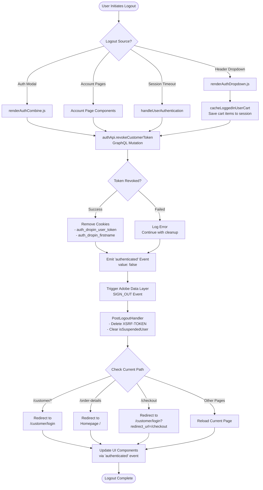
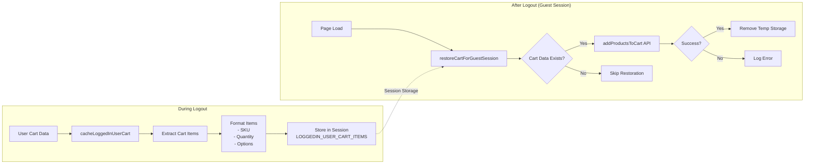
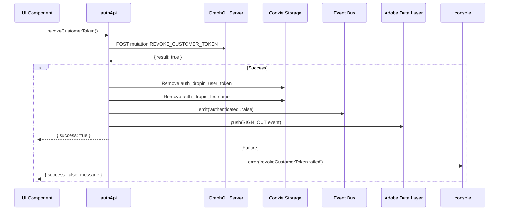
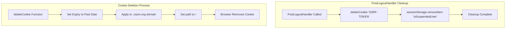
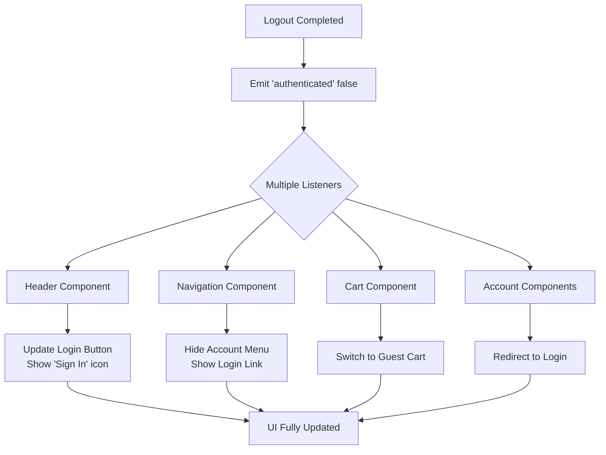
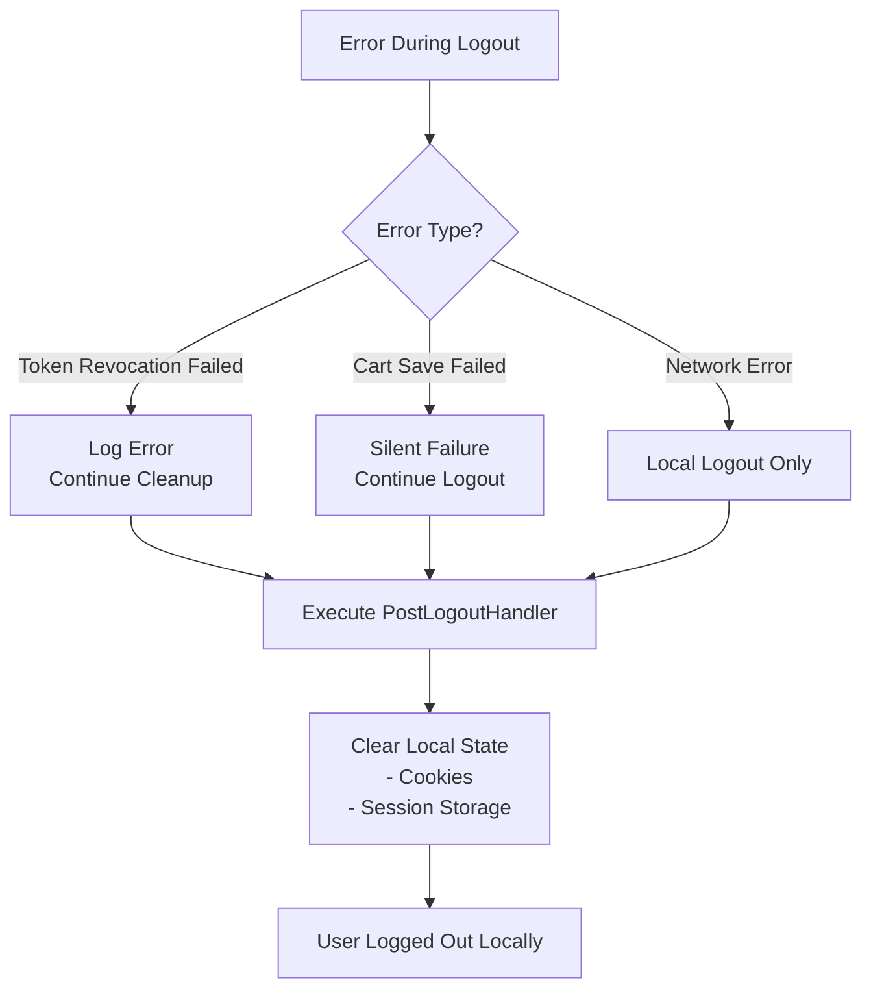
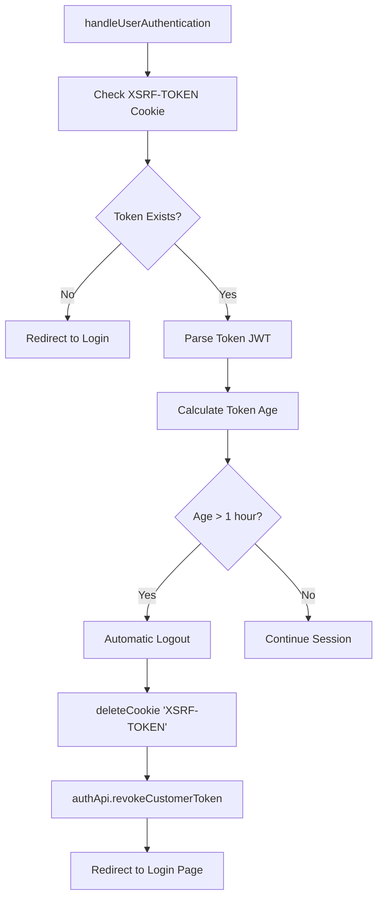

# Logout Flow Diagram

## Complete Logout Process Flow

## Cart Preservation Flow

## Token Revocation Detail

## State Cleanup Flow

## UI Update Flow

## Error Handling Flow

## Session Timeout Flow

