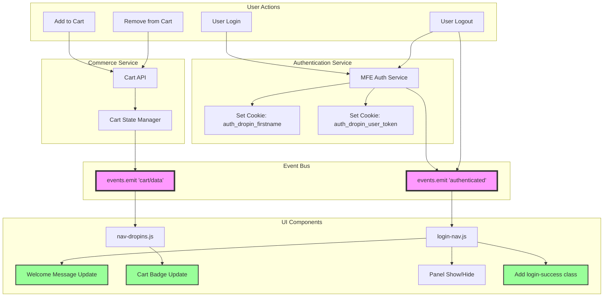
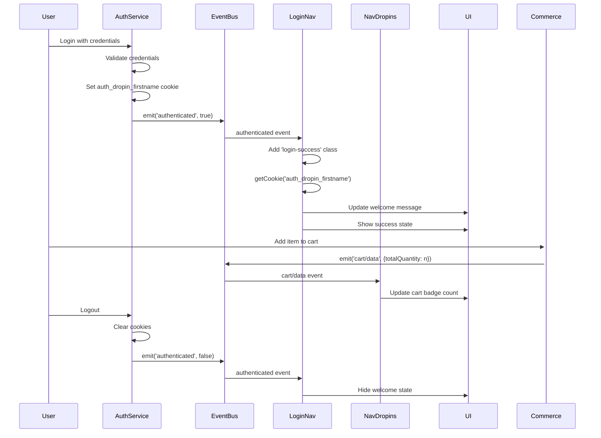

# Navigation Events and Testing Guide

## Overview

This document describes the event-driven architecture for the navigation components, including authentication and cart functionality. It provides testing snippets for validating the implementation in the browser console.

## Event Flow Architecture



## Component Integration



## CSS Class Management

### Login Success State

When a user successfully authenticates, the `login-success` class is added to the `.login-nav` block. This class triggers the display of the welcome message and hides the login form.

```css
/* Default state - login form visible */
.login-nav .ua-welcome-container {
  display: none;
}

/* Success state - welcome message visible */
.login-nav.login-success .login-nav-container {
  display: none;
}

.login-nav.login-success .ua-welcome-container {
  display: flex;
}
```

## Event Listeners

### Authentication Event

**Location:** `blocks/login-nav/login-nav.js`

```javascript
events.on('authenticated', (isAuthenticated) => {
  if (isAuthenticated) {
    // Add login-success class to show welcome state
    block.classList.add('login-success');
    
    // Update the welcome message with the user's first name
    const firstName = getCookie('auth_dropin_firstname') || 'Guest';
    const userNameElement = block.querySelector('.user-name');
    if (userNameElement) {
      userNameElement.textContent = firstName.toUpperCase();
    }
  }
});
```

### Cart Data Event

**Location:** `blocks/nav/nav-dropins.js`

```javascript
// Cart event listener with singleton mini cart support
events.on('cart/data', (data) => {
  // Update desktop and mobile cart buttons
  const cartButtons = document.querySelectorAll('.nav-cart-button');
  cartButtons.forEach((button) => {
    if (data?.totalQuantity) {
      button.setAttribute('data-count', data.totalQuantity);
    } else {
      button.setAttribute('data-count', '0');
    }
  });
}, { eager: true });

// Note: Singleton mini cart automatically moves between containers
// based on viewport width (992px breakpoint) with resize listener
```

## Browser Console Testing Snippets

### 1. Test Authentication Event

```javascript
// Set a test cookie for the user's first name
document.cookie = "auth_dropin_firstname=John; path=/; max-age=3600";

// Import and trigger the authenticated event
import('@dropins/tools/event-bus.js').then(({ events }) => {
  // Trigger authenticated event with true (user logged in)
  events.emit('authenticated', true);
  console.log('✅ Authenticated event triggered');
  console.log('   - Welcome message should show "JOHN"');
  console.log('   - login-success class should be added');
});
```

### 2. Test Cart Badge Update

```javascript
// Import and trigger the cart/data event
import('@dropins/tools/event-bus.js').then(({ events }) => {
  // Simulate cart with 5 items
  events.emit('cart/data', { totalQuantity: 5 });
  console.log('✅ Cart event triggered with 5 items - check cart badge');
  
  // After 3 seconds, update to 10 items
  setTimeout(() => {
    events.emit('cart/data', { totalQuantity: 10 });
    console.log('✅ Cart updated to 10 items');
  }, 3000);
  
  // After 6 seconds, empty the cart
  setTimeout(() => {
    events.emit('cart/data', { totalQuantity: 0 });
    console.log('✅ Cart emptied - badge should disappear');
  }, 6000);
});
```

### 3. Test Both Events Together

```javascript
// Set up and trigger both events
(async () => {
  // Set test user name
  document.cookie = "auth_dropin_firstname=Jane; path=/; max-age=3600";
  
  const { events } = await import('@dropins/tools/event-bus.js');
  
  // Trigger authentication
  events.emit('authenticated', true);
  console.log('✅ User "JANE" logged in');
  
  // Simulate cart activity
  events.emit('cart/data', { totalQuantity: 3 });
  console.log('✅ Cart has 3 items');
})();
```

### 4. Test Logout Scenario

```javascript
// Test unauthenticated state
import('@dropins/tools/event-bus.js').then(({ events }) => {
  // Remove the firstname cookie
  document.cookie = "auth_dropin_firstname=; path=/; expires=Thu, 01 Jan 1970 00:00:00 UTC";
  
  // Trigger authenticated event with false (user logged out)
  events.emit('authenticated', false);
  console.log('✅ User logged out');
});
```

### 5. Test Login Success Class Toggle

```javascript
// Test the login-success class toggle
(async () => {
  const { events } = await import('@dropins/tools/event-bus.js');
  const loginNav = document.querySelector('.login-nav');
  
  if (!loginNav) {
    console.error('❌ Login nav not found');
    return;
  }
  
  // Show current state
  console.log('Initial state:', loginNav.classList.contains('login-success') ? '✅ Logged in' : '⭕ Not logged in');
  
  // Simulate login
  document.cookie = "auth_dropin_firstname=TestUser; path=/; max-age=3600";
  events.emit('authenticated', true);
  
  setTimeout(() => {
    console.log('After login:', loginNav.classList.contains('login-success') ? '✅ Logged in' : '❌ Login failed');
    console.log('Welcome visible:', document.querySelector('.ua-welcome-container')?.offsetParent !== null ? '✅ Yes' : '❌ No');
  }, 100);
});
```

### 6. Simulate Real User Journey

```javascript
// Complete user journey simulation
(async () => {
  const { events } = await import('@dropins/tools/event-bus.js');
  
  console.log('🚀 Starting user journey simulation...');
  
  // Step 1: User logs in
  setTimeout(() => {
    document.cookie = "auth_dropin_firstname=Alice; path=/; max-age=3600";
    events.emit('authenticated', true);
    console.log('1️⃣ User ALICE logged in');
  }, 1000);
  
  // Step 2: Add items to cart
  setTimeout(() => {
    events.emit('cart/data', { totalQuantity: 2 });
    console.log('2️⃣ Added 2 items to cart');
  }, 2000);
  
  // Step 3: Add more items
  setTimeout(() => {
    events.emit('cart/data', { totalQuantity: 5 });
    console.log('3️⃣ Cart updated to 5 items');
  }, 4000);
  
  // Step 4: User logs out
  setTimeout(() => {
    document.cookie = "auth_dropin_firstname=; path=/; expires=Thu, 01 Jan 1970 00:00:00 UTC";
    events.emit('authenticated', false);
    console.log('4️⃣ User logged out');
  }, 6000);
  
  // Step 5: Clear cart
  setTimeout(() => {
    events.emit('cart/data', { totalQuantity: 0 });
    console.log('5️⃣ Cart cleared');
  }, 7000);
});
```

## CSS Selectors for Validation

Use these selectors in the browser console to verify UI updates:

```javascript
// Check welcome message
document.querySelector('.user-name')?.textContent;

// Check cart badge count
document.querySelector('.nav-cart-button')?.getAttribute('data-count');

// Check if login success state is active
document.querySelector('.login-nav.login-success');

// Verify login-success class is present
document.querySelector('.login-nav')?.classList.contains('login-success');

// Check if panels are visible
document.querySelector('.nav-tools-panel--show');
```

## Troubleshooting

### Common Issues

1. **Welcome message shows "GUEST"**
   - Check if `auth_dropin_firstname` cookie is set
   - Verify the authenticated event is triggered with `true`
   - Ensure `login-success` class is added to the block

2. **Cart badge not updating**
   - Ensure `nav-dropins.js` is loaded
   - Check if `.nav-cart-button` elements exist in DOM
   - Verify cart/data event contains `totalQuantity` property

3. **Events not firing**
   - Confirm `@dropins/tools/event-bus.js` is loaded
   - Check browser console for import errors
   - Ensure event listeners are registered before emitting

4. **Welcome state not showing**
   - Verify `login-success` class is added to `.login-nav`
   - Check CSS for `.login-nav.login-success` styles
   - Ensure welcome HTML is present in DOM

### Debug Commands

```javascript
// Check if event bus is loaded
window.events || console.error('Event bus not loaded');

// List all cookies
document.cookie.split(';').forEach(c => console.log(c.trim()));

// Check if nav components are initialized
document.querySelector('desktop-nav-root') || console.error('Desktop nav not found');
document.querySelector('nav-root') || console.error('Mobile nav not found');

// Check login state
const loginNav = document.querySelector('.login-nav');
if (loginNav) {
  console.log('Login state:', loginNav.classList.contains('login-success') ? 'Logged in' : 'Not logged in');
} else {
  console.error('Login nav not found');
}
```

## Related Files

- `/blocks/nav/nav-dropins.js` - Cart event handling and singleton mini cart management
- `/blocks/login-nav/login-nav.js` - Authentication event handling
- `/blocks/nav/desktop-nav-root.js` - Desktop navigation component
- `/blocks/nav/nav-mobile-header.js` - Mobile navigation component
- `/services/mfe-auth-service.js` - Authentication service integration

## Singleton Mini Cart Testing

### Test Responsive Container Movement

```javascript
// Test the singleton mini cart movement between containers
(async () => {
  console.log('🧪 Testing singleton mini cart movement...');
  
  // Check initial state
  const miniCart = document.querySelector('.commerce-mini-cart');
  if (miniCart) {
    console.log('📦 Mini cart found:', miniCart.parentElement.id);
  } else {
    console.log('❌ Mini cart not found - may need to open cart first');
    return;
  }
  
  // Function to check current container
  const checkContainer = () => {
    const currentContainer = miniCart.parentElement.id;
    const viewport = window.innerWidth;
    const expectedContainer = viewport < 992 ? 'mobile-nav-cart-dropin-container' : 'nav-cart-dropin-container';
    
    console.log(`📱 Viewport: ${viewport}px`);
    console.log(`📦 Current container: ${currentContainer}`);
    console.log(`✅ Expected container: ${expectedContainer}`);
    console.log(`${currentContainer === expectedContainer ? '✅' : '❌'} Container placement correct`);
  };
  
  checkContainer();
  
  // Simulate resize events
  console.log('🔄 Simulating resize events...');
  
  // Trigger resize to mobile
  Object.defineProperty(window, 'innerWidth', {
    writable: true,
    configurable: true,
    value: 800
  });
  window.dispatchEvent(new Event('resize'));
  
  setTimeout(() => {
    console.log('📱 After resize to mobile (800px):');
    checkContainer();
    
    // Trigger resize back to desktop
    Object.defineProperty(window, 'innerWidth', {
      writable: true,
      configurable: true,
      value: 1200
    });
    window.dispatchEvent(new Event('resize'));
    
    setTimeout(() => {
      console.log('🖥️ After resize to desktop (1200px):');
      checkContainer();
      
      // Restore original viewport
      Object.defineProperty(window, 'innerWidth', {
        writable: true,
        configurable: true,
        value: document.documentElement.clientWidth
      });
    }, 200); // Account for 150ms debounce
  }, 200);
})();
```