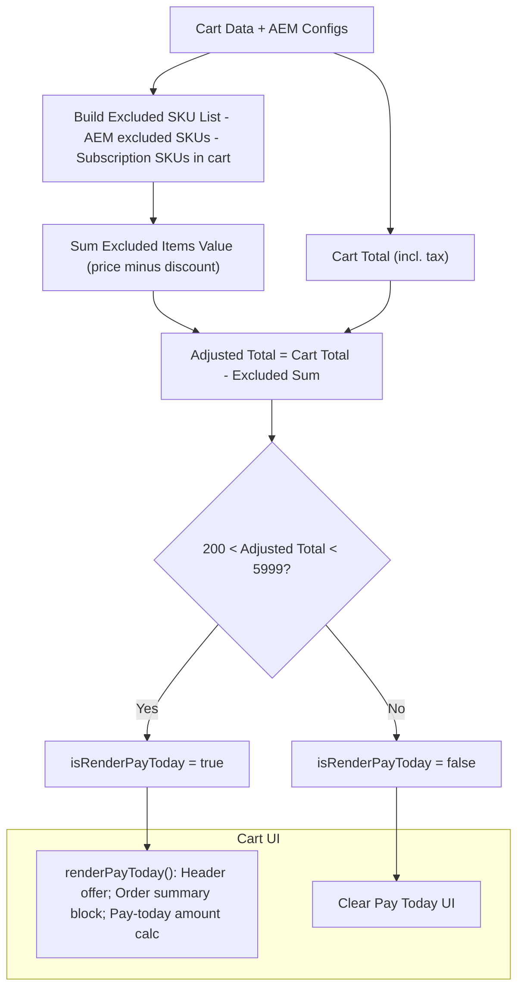

### Pay Today Eligibility and Rendering

This document explains when `isRenderPayToday` is true, how it is calculated, what UI/actions depend on it, and how `isPayTodayEligible` determines eligibility.

#### Key Flags
- **`isRenderPayToday`**: Boolean used by cart UI to decide whether to render “Pay Today” promotional elements.
- **`isPayTodayEligible(cartData, configs)`**: Function that computes the eligibility based on cart contents and AEM-configured rules.

#### Where `isRenderPayToday` is computed
- In `blocks/commerce-cart/commerce-cart.js` within Order Summary updates:
```302:318:/Users/sebastiancorrea/Documents/spruce/nasm/blocks/commerce-cart/commerce-cart.js
isRenderPayToday = isPayTodayEligible(cartData, labels);
const payTodayAmt = isRenderPayToday
  ? parseFloat(cartData?.total?.includingTax?.value) - parseFloat(labels?.cart.paytoday.offer.offerAmount.replace('$', ''))
  : cartData?.total?.includingTax?.value;
```
- On cart change events, re-evaluated and used to re-render:
```502:509:/Users/sebastiancorrea/Documents/spruce/nasm/blocks/commerce-cart/commerce-cart.js
const isRenderPayTodayOnChange = isPayTodayEligible(payload, labels);
renderPayToday({
  payTodayHeaderContainer,
  payTodaySummaryContainer,
  isRenderPayToday: isRenderPayTodayOnChange,
  labels,
});
```

#### Actions/UI based on `isRenderPayToday`
- `shared-components/cart-checkout/index.js` renders Pay Today header and summary sections when true:
```37:56:/Users/sebastiancorrea/Documents/spruce/nasm/shared-components/cart-checkout/index.js
if (isRenderPayToday) {
  payTodayBlock({ container: payTodayHeaderContainer, variation: 'header', ... });
  payTodayBlock({ container: payTodaySummaryContainer, variation: 'order-summary', ... });
} else {
  payTodayHeaderContainer.innerHTML = '';
  if (payTodaySummaryContainer) payTodaySummaryContainer.innerHTML = '';
}
```
- In `commerce-cart.js`, subtotal/total UI references the calculated `payTodayAmt` when eligible, and shows mobile labels associated with the plan.

#### How `isPayTodayEligible` is determined
Defined in `utils/cart-checkout.js`:
```108:152:/Users/sebastiancorrea/Documents/spruce/nasm/utils/cart-checkout.js
export function isPayTodayEligible(cartData, configs) {
  const skuString = configs?.cart?.excludedProducts?.sku;
  const cartTotal = cartData?.total?.includingTax?.value || 0;
  const items = cartData?.items || [];

  // Parse excluded SKUs from configs (AEM)
  const excludedProductSKUs = typeof skuString === 'string' && skuString.trim()
    ? skuString.trim().split(',').map((s) => s.trim())
    : [];

  // Gather subscription SKUs from cart
  const subscribeProductSKUs = items
    .filter((item) => Array.isArray(item?.productAttributes)
      && item.productAttributes.some((attr) => attr.code === 'Is Subscription' && attr.value === '1'))
    .map((item) => item.sku);

  // Sum total of excluded items (configured excluded SKUs + subscriptions)
  const excludedProductsTotal = items.reduce((sum, item) => {
    const itemSku = item?.sku?.trim();
    const isExcluded = [...excludedProductSKUs, ...subscribeProductSKUs].includes(itemSku);
    if (isExcluded) {
      const price = item?.price?.value || 0;
      const discount = item?.discount?.value || 0;
      return sum + (price - discount);
    }
    return sum;
  }, 0);

  // Adjusted total excludes excluded items
  const adjustedTotal = cartTotal - excludedProductsTotal;

  // Eligibility window
  return adjustedTotal > 200 && adjustedTotal < 5999;
}
```

- **Inputs**:
  - `cartData`: totals and items; items may have `productAttributes` marking subscriptions.
  - `configs` (aka `labels` placeholders here): uses `cart.excludedProducts.sku` to read comma-separated SKUs from AEM.
- **Logic**:
  - Build a list of excluded SKUs = configured excluded SKUs + any subscription SKUs found in cart.
  - Compute the total value of excluded items (price − discount).
  - Subtract the excluded total from cart total to get `adjustedTotal`.
  - Eligible if `200 < adjustedTotal < 5999`.

#### Data Flow
- Initial render uses cached cart data to compute `isRenderPayToday` and render the UI.
- On `cart/data` events, `isPayTodayEligible` is recomputed using the new payload and the UI is updated via `renderPayToday`.

#### Mermaid Diagram


#### Notes
- Offer amount used in UI is sourced from placeholders: `labels.cart.paytoday.offer.offerAmount`.
- The pay-today displayed amount is `totalIncludingTax - offerAmount` when eligible; otherwise full total is shown.
- Subscription items always count as excluded regardless of explicit AEM SKU config.
