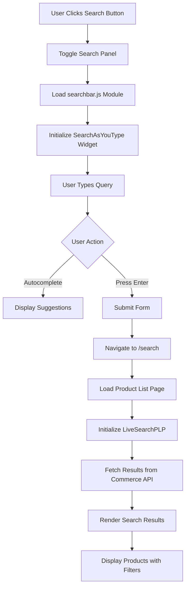
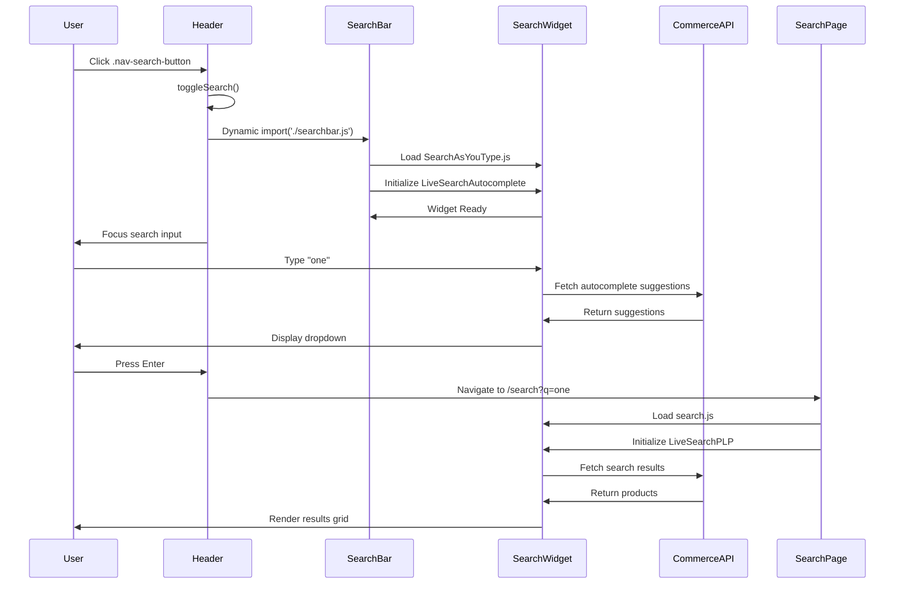
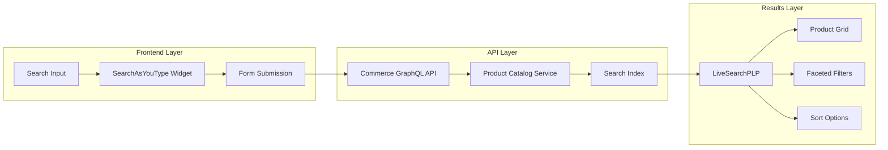
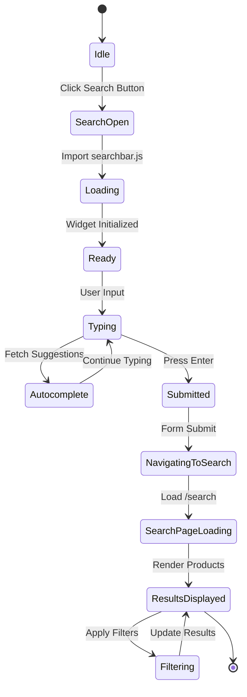
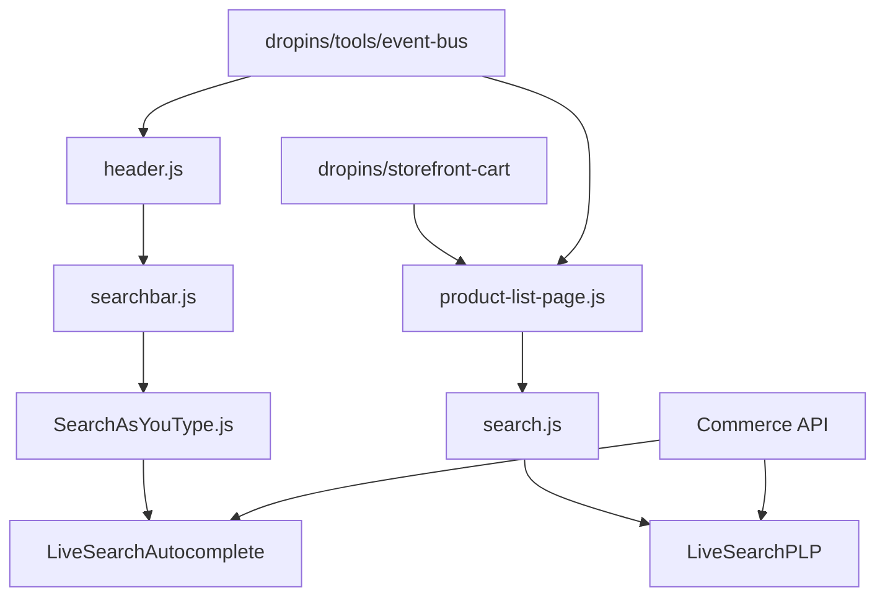

# NASM Search Flow Documentation

## Overview
The NASM website implements a comprehensive search functionality using Adobe Commerce (Magento) integration with LiveSearch components. This document details the complete search flow from user interaction to results display.

## Search Flow Architecture

### High-Level Flow Diagram



## Component Interaction Diagram



## File Structure and Components

### 1. Header Component (`/blocks/header/header.js`)

**Lines 274-317**: Search initialization and toggle functionality

```javascript
// Key functionality:
- Creates search button and input panel
- Manages panel visibility state
- Dynamically imports searchbar.js on first use
- Handles form submission to /search route
```

**Key Functions:**
- `toggleSearch(state)`: Controls search panel visibility
- Event listeners for button click and outside clicks
- Form action routing to `/search` endpoint

### 2. Search Bar Module (`/blocks/header/searchbar.js`)

**Purpose**: Initializes Adobe Commerce search autocomplete

**Configuration Object:**
```javascript
storeDetails = {
  environmentId,      // Commerce environment ID
  apiKey,            // API authentication
  apiUrl,            // Commerce endpoint
  storeCode,         // Store configuration
  config: {
    pageSize: 8,     // Autocomplete results limit
    minQueryLength: 2 // Minimum characters to trigger
  },
  route,            // Product URL pattern
  searchRoute       // Search results page route
}
```

### 3. Search Results Page (`/blocks/product-list-page/product-list-page.js`)

**Purpose**: Renders search results with filtering and sorting

**Key Features:**
- Loads `/scripts/widgets/search.js` widget
- Configures LiveSearchPLP component
- Integrates with cart dropins for add-to-cart
- Handles product routing

## Data Flow Diagram



## Event Flow



## API Integration Points

### 1. Autocomplete API
- **Endpoint**: Configured via `commerce-endpoint` in config
- **Headers**: 
  - `x-api-key`: API authentication
  - `Magento-Store-View-Code`: Store context
- **Minimum Query Length**: 2 characters
- **Response**: Product suggestions with SKU and URL keys

### 2. Search Results API
- **LiveSearchPLP Integration**
- **Pagination**: 12/24/36 items per page
- **Sorting**: Relevance, price, name
- **Filtering**: Categories, price ranges, attributes

## Configuration Details

### Store Configuration (from `configs.js`)
```javascript
{
  'headers.cs.Magento-Environment-Id': // Environment identifier
  'headers.cs.x-api-key':              // API authentication
  'commerce-endpoint':                 // Base API URL
  'headers.cs.Magento-Website-Code':  // Website context
  'headers.cs.Magento-Store-Code':    // Store context
  'headers.cs.Magento-Store-View-Code': // View context
  'headers.cs.Magento-Customer-Group': // Customer segmentation
}
```

## Search URL Parameters

### Query String Structure
- **Base URL**: `/search`
- **Parameters**:
  - `q`: Search query term
  - `sort`: Sort field (relevance, price, etc.)
  - `sortDirection`: asc/desc
  - `page`: Current page number
  - `page_size`: Items per page

### Example URL
```
/search?sort=relevance&sortDirection=desc&q=one&page=1&page_size=12
```

## Widget Dependencies



## Event Tracking

### Analytics Events
1. **search-request-sent**: Fired when search is initiated
   - Contexts: pageContext, storefrontInstanceContext, searchInputContext
   - Tracked in Adobe Data Layer

2. **search-results-view**: Fired when results are displayed
   - Includes result count and query terms

3. **product-click**: Fired when product is clicked from results

## Performance Considerations

1. **Lazy Loading**: Search widgets loaded on-demand
2. **Debouncing**: Autocomplete requests debounced
3. **Caching**: Search results cached client-side
4. **Image Optimization**: 
   - `optimizeImages: true`
   - `imageBaseWidth: 200px`

## Error Handling

1. **Network Failures**: Fallback to basic search
2. **API Errors**: Display error messages to user
3. **No Results**: Show "No products found" message
4. **Widget Load Failures**: Polling mechanism with 200ms intervals

## Testing

### Cypress Test Coverage
- **Location**: `/cypress/src/tests/e2eTests/events/`
- **Test Files**:
  - `search-request-sent.spec.js`: Search initiation
  - `search-results-view.spec.js`: Results display

### Test Flow
```javascript
cy.get('.nav-search-button').click();
cy.get('#search').type('cypress');
cy.get('#search').type('{enter}');
// Verify navigation to /search?q=cypress
// Verify results displayed
```

## Mobile Considerations

- Search panel full-width on mobile
- Touch-optimized autocomplete dropdown
- Responsive grid layout for results
- Filter panel as collapsible drawer

## Future Enhancements

1. **Search History**: Store recent searches
2. **Popular Searches**: Display trending queries
3. **Search Suggestions**: AI-powered recommendations
4. **Voice Search**: Audio input capability
5. **Visual Search**: Image-based product search

## Related Documentation

- [Adobe Commerce LiveSearch Documentation](https://experienceleague.adobe.com/docs/commerce-merchant-services/live-search/overview.html)
- [Edge Delivery Services Integration](https://www.aem.live/)
- [Commerce Dropins Documentation](https://experienceleague.adobe.com/docs/commerce-merchant-services/storefront/dropins.html)

---

*Last Updated: January 2025*
*Document Version: 1.0*