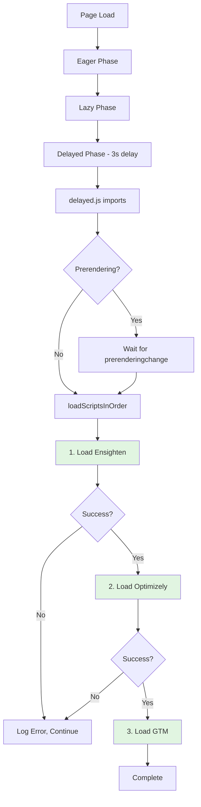

# Third-Party Script Loading Strategy

## Table of Contents
- [Overview](#overview)
- [Problem Statement](#problem-statement)
- [Architecture](#architecture)
- [Script Loading Sequence](#script-loading-sequence)
- [Implementation Details](#implementation-details)
- [Configuration](#configuration)
- [Prerendering Support](#prerendering-support)
- [Error Handling](#error-handling)
- [Performance Considerations](#performance-considerations)
- [Troubleshooting](#troubleshooting)
- [Best Practices](#best-practices)

---

## Overview

The NASM application loads multiple third-party marketing and analytics scripts in a carefully orchestrated sequence to ensure proper initialization, data collection, and tag management across all environments.

### Third-Party Services

| Service | Purpose | Loading Phase | Critical Order |
|---------|---------|---------------|----------------|
| **Ensighten** | Tag Management & Data Collection | Delayed | 1st (Must load first) |
| **Optimizely** | A/B Testing & Experimentation | Delayed | 2nd (After Ensighten) |
| **GTM** (Google Tag Manager) | Analytics & Marketing Tags | Delayed | 3rd (After Optimizely) |
| **Adobe Analytics** | Commerce Events & Analytics | Delayed | Independent |
| **Alive5 Chatbot** | Customer Support Chat | Delayed | Independent |
| **Impact Radius** | Affiliate & Partner Tracking | Delayed | Independent |

---

## Problem Statement

### Original Issue

Third-party scripts were loading in **unpredictable order** due to:

1. **Parallel async loading** - Scripts loaded simultaneously without coordination
2. **Race conditions** - GTM could load before Ensighten
3. **Timing inconsistencies** - Different scripts had different delays
4. **No guaranteed sequence** - Order varied between page loads

### Example of Previous Problematic Flow:
```
scripts.js loadDelayed()
  ├─ 1s → GTM delayed phase  ⚠️ (loads first, too early!)
  └─ 3s → delayed.js imports
            ├─ Ensighten (async, random order)
            └─ Optimizely (async, random order)
```

### Business Impact

- **Data Loss**: Tags firing before Ensighten was ready
- **Tracking Errors**: Analytics events missed or duplicated
- **Experiment Issues**: A/B tests not properly initialized
- **Compliance Risks**: Consent management timing issues

---

## Architecture

### High-Level Design

The solution implements **sequential script loading** with strict ordering guarantees using JavaScript's `async/await` pattern.



### File Structure

```
/scripts/
├── scripts.js           # Main orchestrator (eager/lazy/delayed phases)
├── delayed.js           # Third-party script loader (SEQUENTIAL)
├── gtm-martech.js       # GTM wrapper
└── configs.js           # Configuration management

/plugins/
└── gtm-martech/
    └── src/
        └── index.js     # GTM implementation
```

---

## Script Loading Sequence

### Phase 1: Page Load Foundation

**Location:** `scripts/scripts.js`

```javascript
async function loadPage() {
  await initializeConfig();  // Config must load first
  await loadEager(document);
  await loadLazy(document);
  loadDelayed();            // Non-blocking delayed load
}
```

### Phase 2: Delayed Phase Trigger

**Location:** `scripts/scripts.js` - `loadDelayed()`

```javascript
function loadDelayed() {
  // GTM delayed phase removed from here (moved to delayed.js)
  window.setTimeout(() => import('./delayed.js'), 3000);
}
```

**Timing:** 3 seconds after `loadLazy()` completes

### Phase 3: Sequential Script Loading

**Location:** `scripts/delayed.js` - `loadScriptsInOrder()`

```javascript
async function loadScriptsInOrder() {
  try {
    // Step 1: Ensighten (Tag Management Foundation)
    await initEnsighten();
    console.info('✓ Ensighten loaded');

    // Step 2: Optimizely (Experimentation Platform)
    await initOptimizely();
    console.info('✓ Optimizely loaded');

    // Step 3: GTM (Analytics & Marketing Tags)
    await gtmMartech.delayed();
    console.info('✓ GTM loaded');

  } catch (error) {
    console.error('Error in marketing script sequence:', error);
  }
}
```

---

## Implementation Details

### 1. Ensighten Initialization

**Purpose:** Primary tag management and data collection platform

**Environment Detection:**
- **Production:** `//nexus.ensighten.com/nasm/nasm_prd/Bootstrap.js`
- **Non-Production:** `//nexus.ensighten.com/nasm/nasm_stg/Bootstrap.js`

**Implementation:**
```javascript
async function initEnsighten() {
  try {
    // Prevent duplicate loading
    if (document.getElementById('ensighten')) {
      return;
    }

    const environment = getEnvironment();
    const script = environment === 'prod'
      ? '//nexus.ensighten.com/nasm/nasm_prd/Bootstrap.js'
      : '//nexus.ensighten.com/nasm/nasm_stg/Bootstrap.js';

    await loadScript(script, {
      id: 'ensighten',
      async: true,
    });
  } catch (error) {
    console.error('Error initializing Ensighten', error);
  }
}
```

**Key Features:**
- ✅ Duplicate prevention via ID check
- ✅ Environment-aware script selection
- ✅ Error isolation (doesn't break sequence)
- ✅ Async attribute for non-blocking load

---

### 2. Optimizely Initialization

**Purpose:** A/B testing and experimentation platform

**Project ID:** `25023950326` (configurable)

**Implementation:**
```javascript
async function initOptimizely() {
  try {
    // Prevent duplicate loading
    if (document.getElementById('optimizely-sdk') || window.optimizely) {
      return;
    }

    const environment = getEnvironment();
    const optimizelyProjectId = '25023950326';

    await loadScript(`https://cdn.optimizely.com/js/${optimizelyProjectId}.js`, {
      id: 'optimizely-sdk',
      async: true,
    });

    // Log in non-production
    if (environment !== 'prod') {
      console.info('Optimizely initialized successfully');
    }
  } catch (error) {
    console.warn('Error loading Optimizely:', error);
  }
}
```

**Key Features:**
- ✅ Checks both ID and global object
- ✅ Environment-aware logging
- ✅ Graceful error handling
- ✅ CDN-based delivery

---

### 3. GTM (Google Tag Manager) Initialization

**Purpose:** Analytics and marketing tag orchestration

**Container ID:** `GTM-MLM8WDHN` (loaded in lazy phase)

**Implementation:**
```javascript
// In delayed.js
import gtmMartech from './gtm-martech.js';

async function loadScriptsInOrder() {
  // ... after Ensighten and Optimizely
  await gtmMartech.delayed();
}
```

**GTM Martech Configuration:**
```javascript
// scripts/gtm-martech.js
const martech = new GtmMartech({
  analytics: !disabled,
  containers: {
    lazy: ['GTM-MLM8WDHN'],    // Primary container
    delayed: [],                 // Additional delayed containers
  },
  pageMetadata: {
    site_name: 'NASM',
    content_group1: 'NASM Site',
  },
  consent: !disabled,
  consentCallback: checkConsent,
  decorateCallback: decorateEvents,
});
```

**Loading Phases:**
- **Eager:** GA4 tags initialization
- **Lazy:** GTM container load (line 539 in scripts.js)
- **Delayed:** Additional containers (if configured)

---

### 4. Independent Scripts

These scripts load **independently** and don't affect the critical sequence:

#### Adobe Analytics (Commerce Events)
```javascript
async function initAnalytics() {
  const config = getConfigValue('analytics');
  
  if (config && getConsent('commerce-collection')) {
    // Push storefront context to data layer
    window.adobeDataLayer.push({
      storefrontInstanceContext: { /* ... */ },
      eventForwardingContext: { commerce: true, aep: false },
      shopperContext: { /* ... */ },
    });

    // Dynamically import SDKs
    import('./commerce-events-sdk.js');
    import('./commerce-events-collector.js');
  }
}
```

#### Alive5 Chatbot
```javascript
async function initChatbot() {
  if (document.getElementById('a5widget')) return;

  await loadScript('//alive5.com/js/a5app.js', {
    id: 'a5widget',
    async: true,
    'data-widget_code_id': '83252e7f-24ae-4aac-b9d0-83fdbcecd8b6',
  });
}
```

#### Impact Radius Tracking
```javascript
async function initImpactTracking() {
  if (window.ire_o || document.querySelector('script[src*="impactcdn.com"]')) {
    return;
  }

  window.ire_o = 'ire';
  window.ire = window.ire || function irePlaceholder(...args) {
    (window.ire.a = window.ire.a || []).push(args);
  };

  await loadScript('https://utt.impactcdn.com/A4892188-4ad9-436c-a3b3-30b7488907d91.js', {
    async: true,
  });

  window.ire('identify', {
    customerId: '',
    customerEmail: '',
  });
}
```

---

## Configuration

### Environment Detection

**Function:** `getEnvironment()` in `scripts/configs.js`

```javascript
function getEnvironment() {
  const { hostname } = window.location;
  
  if (hostname.includes('dev-www.') || 
      hostname.includes('main--') || 
      hostname.startsWith('localhost')) {
    return 'dev';
  }
  if (hostname.includes('qa-www.') || hostname.includes('qa--')) {
    return 'qa';
  }
  if (hostname.includes('stg-www.') || hostname.includes('stage--')) {
    return 'stage';
  }
  return 'prod';
}
```

### Config Files

Environment-specific configurations:
- `config.json` - Production
- `config-stage.json` - Staging
- `config-qa.json` - QA
- `config-dev.json` - Development

**Analytics Config Example:**
```json
{
  "public": {
    "default": {
      "analytics": {
        "base-currency-code": "USD",
        "environment": "Production",
        "store-id": 1,
        "store-name": "Main Website Store",
        "store-url": "https://www.nasm.org",
        "store-view-id": 1,
        "store-view-name": "Default Store View",
        "website-id": 1,
        "website-name": "Main Website"
      }
    }
  }
}
```

---

## Prerendering Support

The application supports the [Speculation Rules API](https://developer.mozilla.org/en-US/docs/Web/API/Speculation_Rules_API) for prerendering.

### Detection & Handling

```javascript
// Check prerendering state
if (document.prerendering) {
  // Wait for activation before loading scripts
  document.addEventListener('prerenderingchange', loadScriptsInOrder, { 
    once: true 
  });
} else {
  // Page is active, load immediately
  loadScriptsInOrder();
}
```

### Why This Matters

**Prerendered pages:**
- Are loaded in background
- Have limited JavaScript execution
- Should defer expensive operations
- Need to activate scripts only when visible

**Our Approach:**
- ✅ Detects prerendering state
- ✅ Defers script loading until page activation
- ✅ Maintains strict order even for prerendered pages
- ✅ Single event listener (cleanup automatic via `once: true`)

---

## Error Handling

### Fault Isolation Strategy

Each script loading function uses **try-catch** to prevent cascading failures:

```javascript
async function loadScriptsInOrder() {
  try {
    // 1. Ensighten
    await initEnsighten();
    console.info('✓ Ensighten loaded');

    // 2. Optimizely
    await initOptimizely();
    console.info('✓ Optimizely loaded');

    // 3. GTM
    await gtmMartech.delayed();
    console.info('✓ GTM loaded');

  } catch (error) {
    console.error('Error in marketing script sequence:', error);
    // Sequence continues - other scripts still load
  }
}
```

### Individual Script Error Handling

Each `init` function handles its own errors:

```javascript
async function initEnsighten() {
  try {
    // ... loading logic
  } catch (error) {
    console.error('Error initializing Ensighten', error);
    // Error logged, but Promise resolves (doesn't reject)
    // Next script in sequence will still load
  }
}
```

### Error Scenarios

| Scenario | Behavior | Impact |
|----------|----------|--------|
| Script CDN down | Logs error, continues sequence | Minimal - other scripts load |
| Script timeout | Logs error, continues sequence | Minimal - other scripts load |
| Duplicate load attempt | Early return, no error | None - prevents issues |
| Invalid config | Logs warning, may skip | Some features disabled |
| Network failure | Logs error, continues | Degrades gracefully |

---

## Performance Considerations

### Loading Timeline

```
Time (s)  Event
   0      Page starts loading
   ~1     Eager phase complete (config, critical JS)
   ~2     Lazy phase complete (header, footer, main content)
   3      Delayed phase trigger
   3+     Ensighten loads (async)
   3+Δ₁   Optimizely loads (after Ensighten)
   3+Δ₂   GTM loads (after Optimizely)
   3+     Independent scripts (parallel to sequence)
```

**Δ₁** = Ensighten load time  
**Δ₂** = Δ₁ + Optimizely load time

### Optimization Techniques

1. **Async Loading**
   - All scripts use `async` attribute
   - Non-blocking HTML parsing
   - Parallel download (execution is sequential)

2. **Lazy Evaluation**
   - Scripts load only after 3-second delay
   - Page is interactive before any third-party code

3. **Duplicate Prevention**
   - ID checks before loading
   - Window object checks
   - Early returns prevent re-execution

4. **Resource Hints**
   ```html
   <!-- In head.html -->
   <link rel="preconnect" href="https://www.googletagmanager.com"/>
   <link rel="preload" as="script" crossorigin="anonymous" 
         href="/plugins/gtm-martech/src/index.js"/>
   ```

5. **Dynamic Imports**
   ```javascript
   // Heavy modules loaded on-demand
   import('./commerce-events-sdk.js');
   import('./commerce-events-collector.js');
   ```

### Performance Metrics

**Target Metrics:**
- **First Contentful Paint (FCP):** < 1.5s
- **Largest Contentful Paint (LCP):** < 2.5s
- **Total Blocking Time (TBT):** < 200ms
- **Cumulative Layout Shift (CLS):** < 0.1

**Third-Party Impact:**
- Scripts load **after** LCP (3s+ delay)
- Minimal impact on Core Web Vitals
- Analytics capture all user interactions (even early ones via queuing)

---

## Troubleshooting

### Common Issues

#### 1. Scripts Not Loading in Order

**Symptoms:**
- GTM fires before Ensighten ready
- Console errors about undefined objects
- Missing analytics data

**Diagnosis:**
```javascript
// Check load order in console
console.log('Ensighten loaded:', !!window.Bootstrapper);
console.log('Optimizely loaded:', !!window.optimizely);
console.log('GTM loaded:', !!window.google_tag_manager);
```

**Solutions:**
- ✅ Verify `await` is used in `loadScriptsInOrder()`
- ✅ Check no other scripts are loading GTM independently
- ✅ Confirm `scripts.js` doesn't call `gtmMartech.delayed()` directly

#### 2. Duplicate Script Loading

**Symptoms:**
- Multiple script tags with same ID
- Console warnings about re-initialization
- Unexpected behavior from third-party tools

**Diagnosis:**
```javascript
// Check for duplicates
document.querySelectorAll('[id="ensighten"]').length; // Should be 1
document.querySelectorAll('[id="optimizely-sdk"]').length; // Should be 1
```

**Solutions:**
- ✅ Ensure ID checks are in place
- ✅ Verify `once: true` on event listeners
- ✅ Check no manual script tags in HTML

#### 3. Prerendering Issues

**Symptoms:**
- Scripts load twice
- Timing issues on first visit
- Console errors about `prerenderingchange`

**Diagnosis:**
```javascript
// Check prerendering support
console.log('Prerendering:', document.prerendering);
console.log('Activation time:', performance.getEntriesByType('navigation')[0]?.activationStart);
```

**Solutions:**
- ✅ Verify prerendering check exists
- ✅ Use `once: true` for event cleanup
- ✅ Test in Chrome with prerendering enabled

#### 4. Environment Detection Failing

**Symptoms:**
- Wrong scripts loading for environment
- Production scripts in staging
- Missing environment-specific config

**Diagnosis:**
```javascript
// Check environment detection
import { getEnvironment } from './configs.js';
console.log('Detected environment:', getEnvironment());
console.log('Hostname:', window.location.hostname);
```

**Solutions:**
- ✅ Verify hostname patterns match environment
- ✅ Check config file loaded correctly
- ✅ Confirm environment-specific URLs

---

## Best Practices

### Adding New Third-Party Scripts

#### For Scripts Requiring Specific Order:

1. **Add to Sequential Load Function**
   ```javascript
   async function loadScriptsInOrder() {
     await initEnsighten();
     await initOptimizely();
     await initNewScript();  // Add here in sequence
     await gtmMartech.delayed();
   }
   ```

2. **Create Init Function**
   ```javascript
   async function initNewScript() {
     try {
       if (document.getElementById('new-script')) return;
       
       await loadScript('https://example.com/script.js', {
         id: 'new-script',
         async: true,
       });
     } catch (error) {
       console.error('Error loading new script:', error);
     }
   }
   ```

#### For Independent Scripts:

1. **Add Separate Init Function**
   ```javascript
   async function initIndependentScript() {
     // ... implementation
   }
   ```

2. **Handle Prerendering**
   ```javascript
   if (document.prerendering) {
     document.addEventListener('prerenderingchange', initIndependentScript, { 
       once: true 
     });
   } else {
     initIndependentScript();
   }
   ```

### Testing Checklist

- [ ] Test in all environments (dev, qa, stage, prod)
- [ ] Verify load order in Network tab
- [ ] Check console for errors
- [ ] Test with slow 3G throttling
- [ ] Verify prerendering behavior (Chrome)
- [ ] Test with ad blockers (graceful degradation)
- [ ] Check duplicate prevention
- [ ] Verify error isolation
- [ ] Test consent management flow
- [ ] Validate analytics data collection

### Code Review Guidelines

When reviewing third-party script changes:

1. **Verify Order:**
   - Is the script in correct position?
   - Does it have dependencies?
   - Should it be sequential or independent?

2. **Check Error Handling:**
   - Try-catch present?
   - Errors logged appropriately?
   - Sequence continues on error?

3. **Confirm Duplicate Prevention:**
   - ID check or window object check?
   - Early return if already loaded?

4. **Validate Prerendering:**
   - Prerendering check present?
   - Event listener with `once: true`?

5. **Review Performance:**
   - Async loading?
   - Delayed appropriately?
   - Resource hints added?

---

## Additional Resources

### Internal Documentation
- [Configuration System](./config.md) - Config initialization and usage
- [Analytics Implementation](./adobe-commerce-live-search-implementation.md) - Commerce analytics
- Block Documentation - Individual block implementations

### External References
- [Ensighten Documentation](https://success.ensighten.com/)
- [Optimizely Documentation](https://docs.developers.optimizely.com/)
- [GTM Developer Guide](https://developers.google.com/tag-platform/tag-manager)
- [Speculation Rules API](https://developer.mozilla.org/en-US/docs/Web/API/Speculation_Rules_API)
- [Core Web Vitals](https://web.dev/vitals/)

### Support Contacts
- **Ensighten Issues:** Contact marketing analytics team
- **Optimizely Issues:** Contact experimentation team
- **GTM Issues:** Contact digital analytics team
- **Performance Issues:** Contact web performance team

---

## Change Log

| Date | Change | Author | Ticket |
|------|--------|--------|--------|
| 2025-10-07 | Initial documentation - strict loading order implementation | AI Assistant | NAS-XXX |

---

## Appendix: Complete Code Reference

### scripts/delayed.js (Complete)
```javascript
/* eslint-disable import/no-cycle */
import gtmMartech from './gtm-martech.js';
import { getConfigValue, getEnvironment } from './configs.js';
import { getUserTokenCookie } from './initializers/index.js';
import { getConsent } from './scripts.js';
import { loadScript } from './aem.js';

// ===== ENSIGHTEN =====
async function initEnsighten() {
  try {
    if (document.getElementById('ensighten')) {
      return;
    }
    const environment = getEnvironment();
    const script = environment === 'prod'
      ? '//nexus.ensighten.com/nasm/nasm_prd/Bootstrap.js'
      : '//nexus.ensighten.com/nasm/nasm_stg/Bootstrap.js';

    await loadScript(script, {
      id: 'ensighten',
      async: true,
    });
  } catch (error) {
    console.error('Error initializing Ensighten', error);
  }
}

// ===== OPTIMIZELY =====
async function initOptimizely() {
  try {
    if (document.getElementById('optimizely-sdk') || window.optimizely) {
      return;
    }

    const environment = getEnvironment();
    const optimizelyProjectId = '25023950326';

    await loadScript(`https://cdn.optimizely.com/js/${optimizelyProjectId}.js`, {
      id: 'optimizely-sdk',
      async: true,
    });

    if (environment !== 'prod') {
      console.info('Optimizely initialized successfully');
    }
  } catch (error) {
    console.warn('Error loading Optimizely:', error);
  }
}

// ===== SEQUENTIAL LOADING (STRICT ORDER) =====
/**
 * Load critical marketing scripts in strict order
 * Order: Ensighten → Optimizely → GTM
 */
async function loadScriptsInOrder() {
  try {
    // 1. Ensighten (Tag Management Foundation)
    await initEnsighten();
    console.info('✓ Ensighten loaded');

    // 2. Optimizely (Experimentation Platform)
    await initOptimizely();
    console.info('✓ Optimizely loaded');

    // 3. GTM (Analytics & Marketing Tags)
    await gtmMartech.delayed();
    console.info('✓ GTM loaded');

  } catch (error) {
    console.error('Error in marketing script sequence:', error);
  }
}

// Initialize ordered scripts (with prerendering support)
if (document.prerendering) {
  document.addEventListener('prerenderingchange', loadScriptsInOrder, { once: true });
} else {
  loadScriptsInOrder();
}

// ===== ANALYTICS (INDEPENDENT) =====
async function initAnalytics() {
  try {
    const config = getConfigValue('analytics');

    if (config && getConsent('commerce-collection')) {
      const csHeaders = getConfigValue('headers.cs');

      window.adobeDataLayer.push(
        {
          storefrontInstanceContext: {
            baseCurrencyCode: config['base-currency-code'],
            environment: config.environment,
            environmentId: csHeaders['Magento-Environment-Id'],
            storeCode: csHeaders['Magento-Store-Code'],
            storefrontTemplate: 'EDS',
            storeId: parseInt(config['store-id'], 10),
            storeName: config['store-name'],
            storeUrl: config['store-url'],
            storeViewCode: csHeaders['Magento-Store-View-Code'],
            storeViewCurrencyCode: config['base-currency-code'],
            storeViewId: parseInt(config['store-view-id'], 10),
            storeViewName: config['store-view-name'],
            websiteCode: csHeaders['Magento-Website-Code'],
            websiteId: parseInt(config['website-id'], 10),
            websiteName: config['website-name'],
          },
        },
        { eventForwardingContext: { commerce: true, aep: false } },
        {
          shopperContext: {
            shopperId: getUserTokenCookie() ? 'logged-in' : 'guest',
          },
        },
      );

      import('./commerce-events-sdk.js');
      import('./commerce-events-collector.js');
    }
  } catch (error) {
    console.warn('Error initializing analytics', error);
  }
}

if (document.prerendering) {
  document.addEventListener('prerenderingchange', initAnalytics, { once: true });
} else {
  initAnalytics();
}

// ===== CHATBOT (INDEPENDENT) =====
async function initChatbot() {
  try {
    if (document.getElementById('a5widget')) {
      return;
    }

    await loadScript('//alive5.com/js/a5app.js', {
      id: 'a5widget',
      async: true,
      'data-widget_code_id': '83252e7f-24ae-4aac-b9d0-83fdbcecd8b6',
    });
  } catch (error) {
    console.warn('Error loading chatbot:', error);
  }
}

if (document.prerendering) {
  document.addEventListener('prerenderingchange', initChatbot, { once: true });
} else {
  initChatbot();
}

// ===== IMPACT TRACKING (INDEPENDENT) =====
async function initImpactTracking() {
  try {
    if (window.ire_o || document.querySelector('script[src*="impactcdn.com"]')) {
      return;
    }

    window.ire_o = 'ire';
    window.ire = window.ire || function irePlaceholder(...args) {
      (window.ire.a = window.ire.a || []).push(args);
    };

    const impactScriptUrl = 'https://utt.impactcdn.com/A4892188-4ad9-436c-a3b3-30b7488907d91.js';
    await loadScript(impactScriptUrl, {
      async: true,
    });
    
    window.ire('identify', {
      customerId: '',
      customerEmail: '',
    });
  } catch (error) {
    console.warn('Error loading Impact tracking:', error);
  }
}

if (document.prerendering) {
  document.addEventListener('prerenderingchange', initImpactTracking, { once: true });
} else {
  initImpactTracking();
}
```

### scripts/scripts.js - loadDelayed() (Modified)
```javascript
function loadDelayed() {
  // GTM delayed phase removed - now handled in delayed.js for strict ordering
  window.setTimeout(() => import('./delayed.js'), 3000);
}
```

---

**Document Version:** 1.0  
**Last Updated:** October 7, 2025  
**Maintained By:** NASM Development Team

