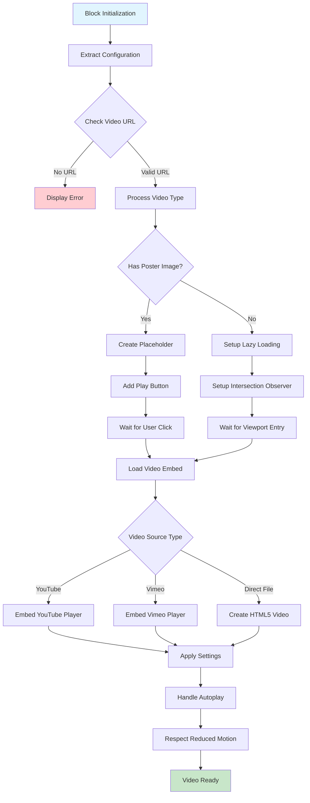
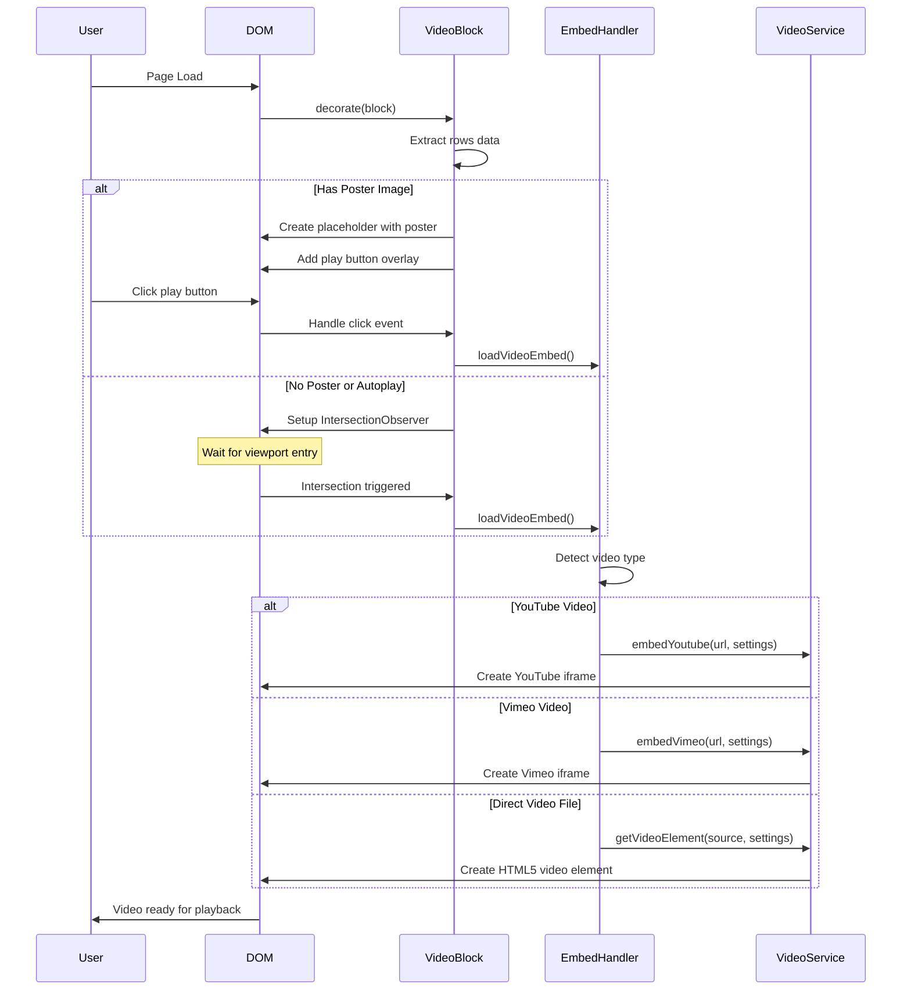
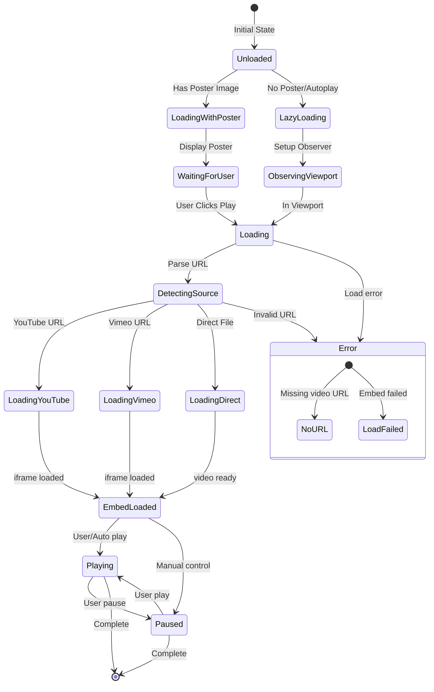

# Video Block Component Analysis

## Overview
The Video Block is a versatile component in the NASM AEM Edge Delivery Services project that handles video embedding from multiple sources including YouTube, Vimeo, and direct video files. It provides lazy loading, poster image support, and accessibility features.

## Architecture

### File Structure
```
blocks/video/
├── video.js         # Main JavaScript implementation
├── video.css        # Styling and responsive design
└── _video.json      # AEM model configuration
```

## Component Flow Diagram



## Data Flow and Processing



## Component States



## Technical Implementation Details

### 1. **Video Sources Support**
- **YouTube**: Supports both youtube.com and youtu.be URLs
- **Vimeo**: Direct vimeo.com video URLs
- **Direct Files**: MP4, WebM, OGG formats via HTML5 video element

### 2. **Configuration Options**

```javascript
// Extracted from block rows
const config = {
    videoUrl: rows[0]?.querySelector('a')?.href,    // Required: Video URL
    posterImg: rows[1]?.querySelector('img'),        // Optional: Poster image
    title: rows[3]?.textContent.trim(),              // Optional: Accessibility title
    autoplay: false,                                  // Default setting
    background: false                                 // Default setting
}
```

### 3. **Embed Parameters**

#### YouTube Parameters
```javascript
{
    autoplay: '0' or '1',
    mute: '0' or '1',        // Muted for background videos
    controls: '0' or '1',    // Hidden for background videos
    disablekb: '0' or '1',   // Keyboard disabled for background
    loop: '0' or '1',        // Loops for background videos
    playsinline: '0' or '1', // Mobile inline playback
    rel: '0'                 // No related videos
}
```

#### Vimeo Parameters
```javascript
{
    autoplay: '0' or '1',
    background: '0' or '1'   // Background mode
}
```

### 4. **Lazy Loading Strategy**
- Uses `IntersectionObserver` for viewport detection
- Loads video only when visible or about to be visible
- Reduces initial page load and bandwidth usage

### 5. **Accessibility Features**
- Configurable title attribute for screen readers
- Play button with semantic HTML
- Keyboard navigation support (unless background mode)
- Respects `prefers-reduced-motion` user preference

### 6. **Responsive Design**

#### Breakpoints
- **Mobile (<640px)**: 
  - Smaller play button (48x48px)
  - Reduced margins (16px)
  
- **Tablet (640px-1024px)**:
  - Medium sizing
  - 20px margins
  
- **Desktop (>1024px)**:
  - Full size play button (64x64px)
  - 32px margins

### 7. **CSS Classes and States**

```css
.video                           /* Main container */
.video.placeholder              /* Has poster image */
.video.autoplay                 /* Autoplay enabled */
.video[data-embed-loaded='true'] /* Video loaded */
.video[data-embed-loaded='false'] /* Loading state */
.video-placeholder              /* Poster container */
.video-placeholder-play         /* Play button overlay */
```

## Integration Points

### 1. **AEM Integration**
- Component registered in `_video.json` with xwalk plugin
- Model fields mapped to AEM dialog
- Content authored in AEM, delivered via Edge Delivery

### 2. **Edge Delivery Services**
- Block decorator pattern via `export default async function decorate(block)`
- DOM manipulation using vanilla JavaScript
- No external dependencies required

### 3. **Performance Optimizations**
- Lazy loading with IntersectionObserver
- Deferred iframe/video creation
- Poster images for faster perceived load
- Respects reduced motion preferences

## Usage Example

### AEM Authoring
```json
{
  "videoUrl": "https://www.youtube.com/watch?v=dQw4w9WgXcQ",
  "poster": "/content/dam/poster.jpg",
  "posterAlt": "Video thumbnail",
  "title": "Product demonstration video",
  "autoplay": false
}
```

### HTML Output (Before JavaScript)
```html
<div class="video block">
  <div>
    <a href="https://www.youtube.com/watch?v=...">Video Link</a>
  </div>
  <div>
    <picture>
      
    </picture>
  </div>
  <div></div>
  <div>Product demonstration video</div>
</div>
```

### HTML Output (After JavaScript)
```html
<div class="video block placeholder" data-embed-loaded="false">
  <div class="video-placeholder">
    <picture>
      
    </picture>
    <div class="video-placeholder-play">
      <button type="button" title="Play"></button>
    </div>
  </div>
</div>
```

### After Play Click
```html
<div class="video block placeholder" data-embed-loaded="true">
  <div style="position: relative; padding-bottom: 56.25%;">
    <iframe src="https://www.youtube.com/embed/..." 
            style="position: absolute; width: 100%; height: 100%;"
            allow="autoplay; fullscreen; ..."
            title="Product demonstration video">
    </iframe>
  </div>
</div>
```

## Key Features for Masonry Integration

When integrating with the Masonry component, consider these video block characteristics:

1. **Dynamic Height**: Videos maintain 16:9 aspect ratio by default
2. **Lazy Loading**: Videos load on-demand, reducing initial layout calculations
3. **State Management**: `data-embed-loaded` attribute tracks loading state
4. **Responsive**: Adapts to container width automatically
5. **Event Handling**: Click events on poster images trigger video loading
6. **No External Dependencies**: Pure vanilla JavaScript implementation

## Browser Compatibility
- Modern browsers with IntersectionObserver support
- Fallback for older browsers included
- Mobile-optimized with playsinline support
- Reduced motion preference respected

## Security Considerations
- iframe sandboxing for embedded content
- URL validation for video sources
- No user-generated content in embed URLs
- CSP-compatible implementation

## Performance Metrics
- **Initial Load**: Only poster image loaded
- **Time to Interactive**: Immediate with poster
- **Bandwidth Usage**: Deferred until user interaction
- **Layout Shift**: Minimal with aspect-ratio preservation